Exploratory\_Data\_Analysis
================
Chance Robinson
9/21/2019

  - [Exploratory Data Analysis](#exploratory-data-analysis)
      - [Library Imports](#library-imports)
      - [Load the csv data](#load-the-csv-data)
      - [Column Names (Train)](#column-names-train)
      - [Example Output (Train)](#example-output-train)
      - [Example output (Test)](#example-output-test)
      - [Identify Dimensions](#identify-dimensions)
      - [Missing Data (Both)](#missing-data-both)
      - [Data Dictionary](#data-dictionary)
      - [Factors](#factors)
      - [Split Date-Time (Both)](#split-date-time-both)
      - [Convert Months to Ordered Factor
        (Both)](#convert-months-to-ordered-factor-both)
      - [Count by Month (Train)](#count-by-month-train)
      - [Count by Month (Test)](#count-by-month-test)
      - [Days (Train)](#days-train)
      - [Days (Test)](#days-test)
      - [Outlier](#outlier)
      - [Explanatory Variable plots against Response
        Variable](#explanatory-variable-plots-against-response-variable)
      - [Model Fitting](#model-fitting)
      - [RMSLE: Root Mean Squared Logarithmic Error
        Loss](#rmsle-root-mean-squared-logarithmic-error-loss)

## Exploratory Data Analysis

### Library Imports

``` r
library(tidyverse)
```

    ## -- Attaching packages ------------------------------------------------------------------------------------------------------------------------ tidyverse 1.2.1 --

    ## v ggplot2 3.2.0     v purrr   0.3.2
    ## v tibble  2.1.3     v dplyr   0.8.3
    ## v tidyr   0.8.3     v stringr 1.4.0
    ## v readr   1.3.1     v forcats 0.4.0

    ## -- Conflicts --------------------------------------------------------------------------------------------------------------------------- tidyverse_conflicts() --
    ## x dplyr::filter() masks stats::filter()
    ## x dplyr::lag()    masks stats::lag()

``` r
# Date manipulation
library(lubridate)
```

    ## 
    ## Attaching package: 'lubridate'

    ## The following object is masked from 'package:base':
    ## 
    ##     date

``` r
# Plotting
library(olsrr)
```

    ## 
    ## Attaching package: 'olsrr'

    ## The following object is masked from 'package:datasets':
    ## 
    ##     rivers

``` r
# RMLSE
library(MLmetrics)
```

    ## 
    ## Attaching package: 'MLmetrics'

    ## The following object is masked from 'package:base':
    ## 
    ##     Recall

### Load the csv data

``` r
train <- read_csv('../../../data/train.csv')
test <- read_csv('../../../data/test.csv')
```

### Column Names (Train)

``` r
colnames(train)
```

    ##  [1] "datetime"   "season"     "holiday"    "workingday" "weather"   
    ##  [6] "temp"       "atemp"      "humidity"   "windspeed"  "casual"    
    ## [11] "registered" "count"

### Example Output (Train)

``` r
head(train)
```

    ## # A tibble: 6 x 12
    ##   datetime            season holiday workingday weather  temp atemp
    ##   <dttm>               <dbl>   <dbl>      <dbl>   <dbl> <dbl> <dbl>
    ## 1 2011-01-01 00:00:00      1       0          0       1  9.84  14.4
    ## 2 2011-01-01 01:00:00      1       0          0       1  9.02  13.6
    ## 3 2011-01-01 02:00:00      1       0          0       1  9.02  13.6
    ## 4 2011-01-01 03:00:00      1       0          0       1  9.84  14.4
    ## 5 2011-01-01 04:00:00      1       0          0       1  9.84  14.4
    ## 6 2011-01-01 05:00:00      1       0          0       2  9.84  12.9
    ## # ... with 5 more variables: humidity <dbl>, windspeed <dbl>,
    ## #   casual <dbl>, registered <dbl>, count <dbl>

### Example output (Test)

  - The test data set is missing 3 columns from the train data set
    (causal, registered and count)

<!-- end list -->

``` r
head(test)
```

    ## # A tibble: 6 x 9
    ##   datetime            season holiday workingday weather  temp atemp
    ##   <dttm>               <dbl>   <dbl>      <dbl>   <dbl> <dbl> <dbl>
    ## 1 2011-01-20 00:00:00      1       0          1       1 10.7   11.4
    ## 2 2011-01-20 01:00:00      1       0          1       1 10.7   13.6
    ## 3 2011-01-20 02:00:00      1       0          1       1 10.7   13.6
    ## 4 2011-01-20 03:00:00      1       0          1       1 10.7   12.9
    ## 5 2011-01-20 04:00:00      1       0          1       1 10.7   12.9
    ## 6 2011-01-20 05:00:00      1       0          1       1  9.84  11.4
    ## # ... with 2 more variables: humidity <dbl>, windspeed <dbl>

### Identify Dimensions

  - Train {“rows”: 10886, “columns”: 12}

  - Test {“rows”: 6493, “columns”: 9}

### Missing Data (Both)

  - No NA values can be found in either the training or test data sets

<!-- end list -->

``` r
# train
any(is.na(train))
```

    ## [1] FALSE

``` r
# test
any(is.na(test))
```

    ## [1] FALSE

``` r
train$count <- log(train$count)
```

### Data Dictionary

| Column Name     | Type Description |                                                |
| --------------- | ---------------- | ---------------------------------------------- |
| 1\. datetime    | Date             | YYYY-MM-DD HH24 (example: 2011-01-01 04:00:00) |
| 2\. season      | Integer          | (1-4)                                          |
| 3\. holiday     | Integer          | (0 or 1)                                       |
| 4\. workingday  | Integer          | (0 or 1)                                       |
| 5\. weather     | Integer          | (1-4)                                          |
| 6\. temp        | Float            | temparture in Celcius                          |
| 7\. atemp       | Float            | “feels like” temperature in Celsius            |
| 8\. humidity    | Integer          | relative humidity                              |
| 9\. windspeed   | Float            | wind speed                                     |
| 10\. casual     | Integer          | count of casual users                          |
| 11\. registered | Integer          | count of registered users                      |
| 12\. count      | Integer          | count of total users `response variable`       |

### Factors

  - season
      - 1 = Dec 21 \~ March 20 (Spring)
      - 2 = March 21 \~ Jun 20 (Summer)
      - 3 = June 21 \~ Sept 20 (Fall)
      - 4 = Sept 21 \~ Dec 20 (Winter)
  - holiday
      - 0 = No
      - 1 = Yes
  - workingday
      - 0 = No
      - 1 =
Yes

<!-- end list -->

``` r
train$season <- factor(train$season, labels = c("Spring", "Summer", "Fall", "Winter"))
test$season <- factor(test$season, labels = c("Spring", "Summer", "Fall", "Winter"))

table(train$season)
```

    ## 
    ## Spring Summer   Fall Winter 
    ##   2686   2733   2733   2734

``` r
train$holiday <- factor(train$holiday, labels = c("No", "Yes"))
test$holiday <- factor(test$holiday, labels = c("No", "Yes"))

table(train$holiday)
```

    ## 
    ##    No   Yes 
    ## 10575   311

``` r
train$workingday <- factor(train$workingday, labels = c("No", "Yes"))
test$workingday <- factor(test$workingday, labels = c("No", "Yes"))

table(train$workingday)
```

    ## 
    ##   No  Yes 
    ## 3474 7412

``` r
train$weather <- factor(train$weather, labels = c("Great", "Good", "Average", "Poor"))
test$weather <- factor(test$weather, labels = c("Great", "Good", "Average", "Poor"))


table(train$weather)
```

    ## 
    ##   Great    Good Average    Poor 
    ##    7192    2834     859       1

### Split Date-Time (Both)

  - Year, Month, Day and Hour

<!-- end list -->

``` r
library(lubridate)

train <- train %>%
  mutate(year = as.factor(format(datetime, format = "%Y")), 
         month = as.numeric(format(datetime, format = "%m")), 
         day = as.factor(format(datetime, format = "%d")),
         hour = as.factor(format(datetime, format = "%H")))

test <- test %>%
  mutate(year = as.factor(format(datetime, format = "%Y")), 
         month = as.numeric(format(datetime, format = "%m")), 
         day = as.factor(format(datetime, format = "%d")),
         hour = as.factor(format(datetime, format = "%H")))
```

### Convert Months to Ordered Factor (Both)

``` r
train$month <-month(train$datetime, label = TRUE, abbr = FALSE)
test$month <-month(test$datetime, label = TRUE, abbr = FALSE)
```

### Count by Month (Train)

  - The months seem to show an upward trend throughout the year
  - Increased popularity of Ride-Sharing program?

<!-- end list -->

``` r
train %>%
  ggplot(aes(x = month)) + 
  geom_bar() +
  theme(axis.text.x = element_text(angle = 90, hjust = 1))
```

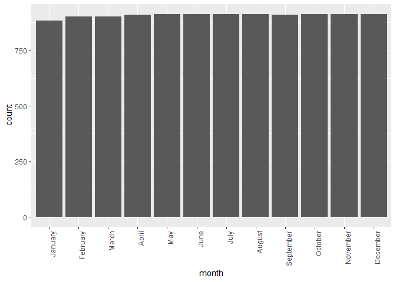<!-- -->

### Count by Month (Test)

  - Notice how the months with fewer days have fewer totals
    (i.e…February)

<!-- end list -->

``` r
test %>%
  ggplot(aes(x = month)) + 
  geom_bar() +
  theme(axis.text.x = element_text(angle = 90, hjust = 1))
```

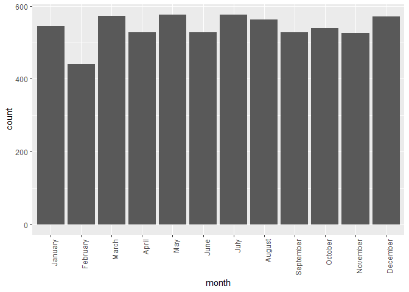<!-- -->

### Days (Train)

  - The train data set covers days from the 1st through the 19th

<!-- end list -->

``` r
train %>%
  ggplot(aes(x = day)) + 
  geom_bar()
```

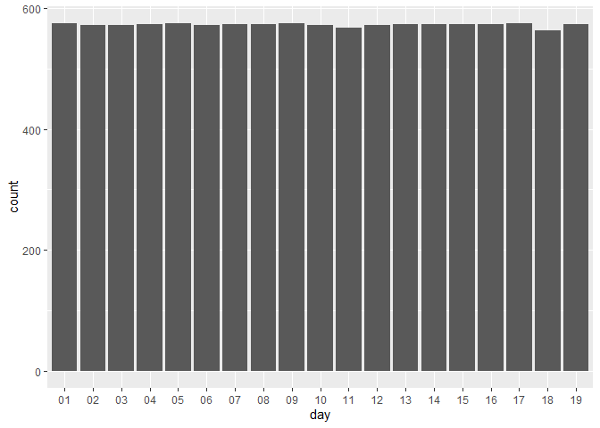<!-- -->

### Days (Test)

  - The test set covers days from the 20th through the 31st

<!-- end list -->

``` r
test %>%
  ggplot(aes(x = day)) + 
  geom_bar()
```

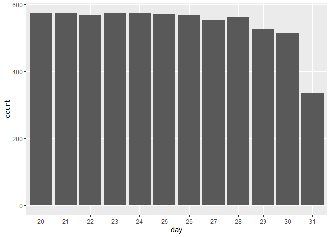<!-- -->

### Outlier

``` r
outliers <- train[   train$count < median(train$count) - (sd(train$count) * 3), ]
# outliers


## maybe remove observations where the count is more than 2-3 SDs from the mean of the month instead?

train %>%
  group_by(month) %>%
  summarize(mean = mean(count), sd = sd(count), median = median(count), observations = n())
```

    ## # A tibble: 12 x 5
    ##    month      mean    sd median observations
    ##    <ord>     <dbl> <dbl>  <dbl>        <int>
    ##  1 January    3.78  1.47   4.17          884
    ##  2 February   3.98  1.51   4.36          901
    ##  3 March      4.19  1.61   4.61          901
    ##  4 April      4.46  1.53   4.89          909
    ##  5 May        4.76  1.43   5.20          912
    ##  6 June       4.89  1.38   5.33          912
    ##  7 July       4.90  1.35   5.34          912
    ##  8 August     4.86  1.37   5.26          912
    ##  9 September  4.81  1.42   5.24          909
    ## 10 October    4.79  1.42   5.19          911
    ## 11 November   4.65  1.40   5.09          911
    ## 12 December   4.52  1.43   4.93          912

``` r
# remove outliers
train <- train %>%
  filter(!datetime %in% outliers$datetime)


# train[5555, ] # 2012-01-09 18:00:00


train <- train %>%
  filter(datetime != '2012-01-09 18:00:00')
```

### Explanatory Variable plots against Response Variable

#### Continuous Variables

``` r
train %>%
  ggplot(aes(x = temp, y = count)) + 
  geom_point(alpha = 0.3) + 
  scale_x_continuous(breaks = seq(from = 0, to = 45, by = 2.9)) + 
  geom_smooth(method = 'lm')
```

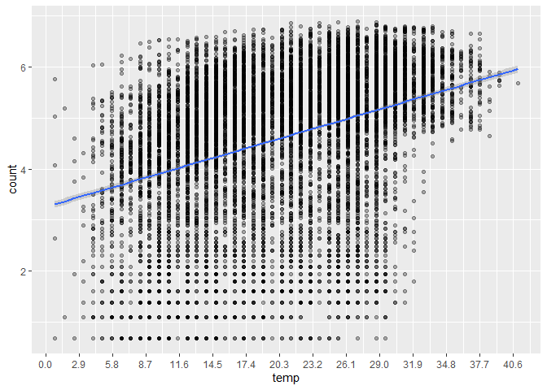<!-- -->

``` r
train %>%
  ggplot(aes(x = atemp, y = count)) + 
  geom_point(alpha = 0.3) + 
  scale_x_continuous(breaks = seq(from = 0, to = 45, by = 2)) + 
  geom_smooth(method = 'lm')
```

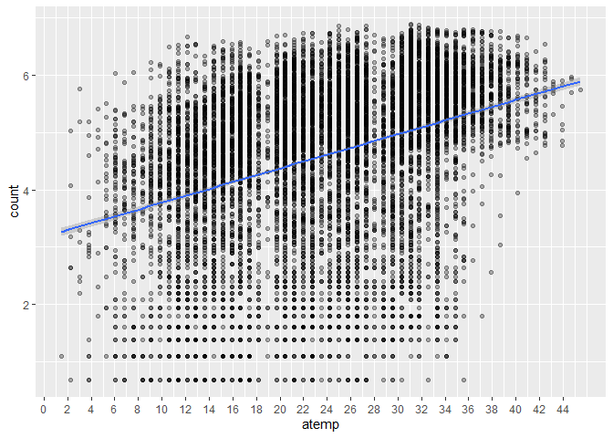<!-- -->

``` r
train %>%
  ggplot(aes(x = windspeed, y = count)) + 
  geom_point(alpha = 0.3) + 
  scale_x_continuous(breaks = seq(from = 0, to = 45, by=2)) + 
  geom_smooth(method = 'lm')
```

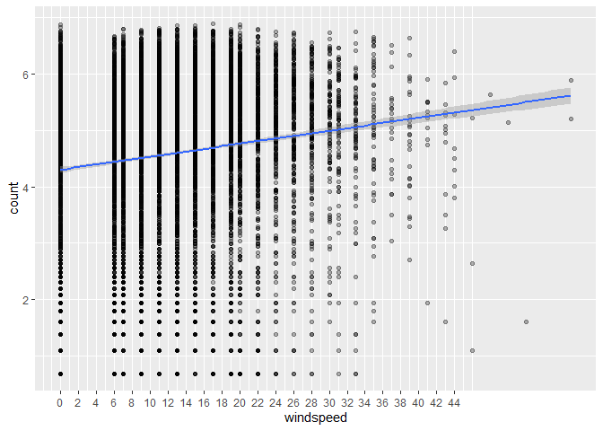<!-- -->

#### Categorical Variables

``` r
train %>%
  ggplot(aes(x=season, y=count, fill=season)) + geom_boxplot()
```

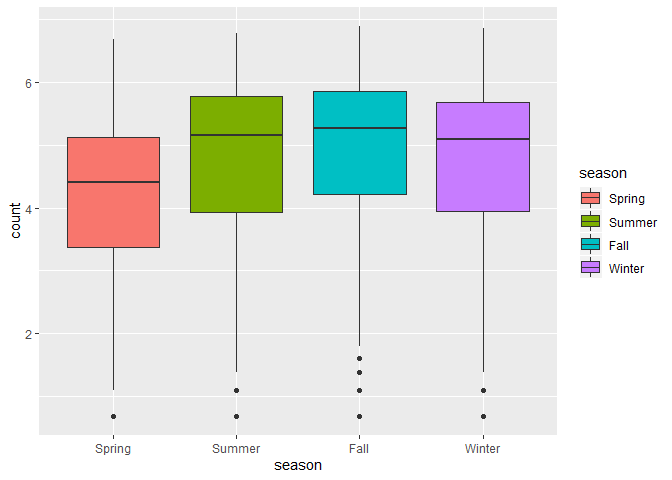<!-- -->

``` r
train %>%
  ggplot(aes(x=holiday, y=count, fill=holiday)) + geom_boxplot()
```

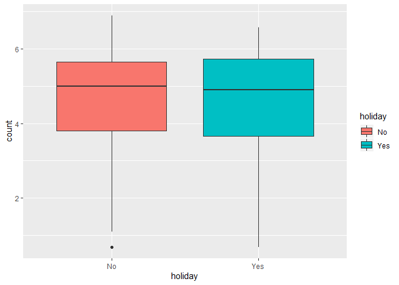<!-- -->

``` r
train %>%
  ggplot(aes(x=workingday, y=count, fill=workingday)) + geom_boxplot()
```

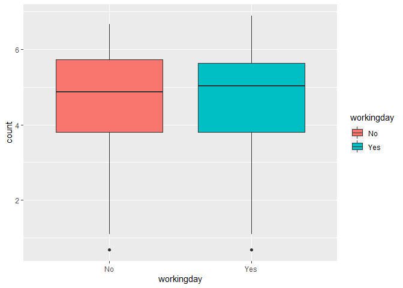<!-- -->

``` r
train %>%
  ggplot(aes(x=weather, y=count, fill=weather)) + geom_boxplot()
```

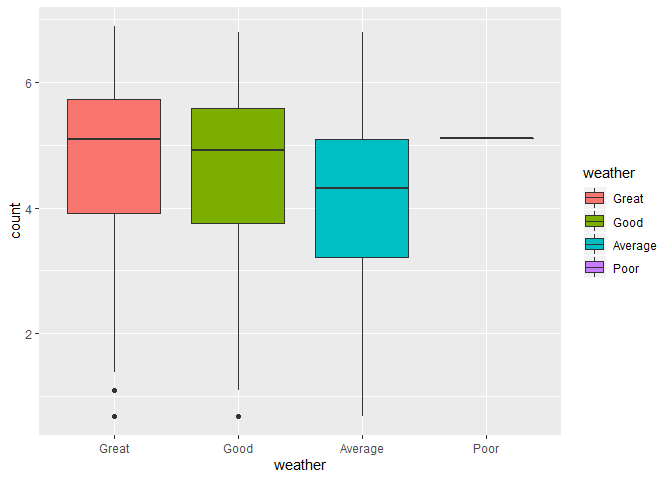<!-- -->

``` r
train %>%
  ggplot(aes(x=month, y=count, fill=month)) + geom_boxplot() + 
  theme(axis.text.x = element_text(angle = 90, hjust = 1))
```

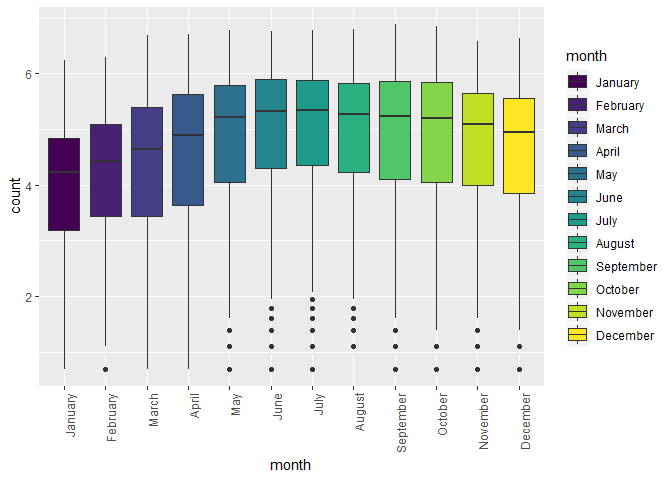<!-- -->

### Model Fitting

``` r
model.base.formula = count ~ weather + 
                             windspeed + 
                             temp + 
                             month +
                             hour +
                             month:hour
  
  # datetime


model  <- lm(formula = model.base.formula, data = train)

plot(model)
```

    ## Warning: not plotting observations with leverage one:
    ##   5555

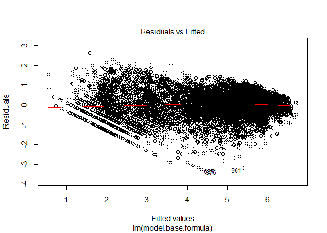<!-- -->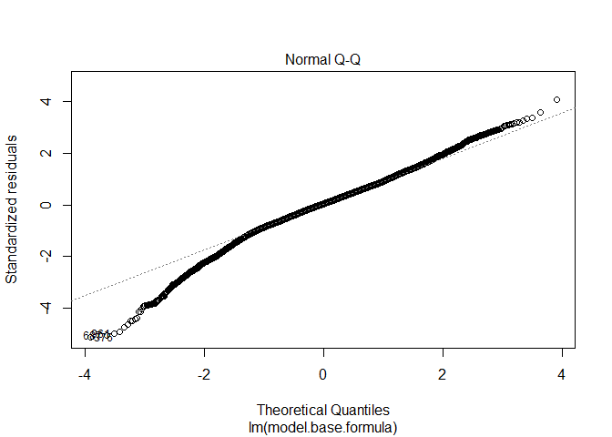<!-- -->

    ## Warning: not plotting observations with leverage one:
    ##   5555

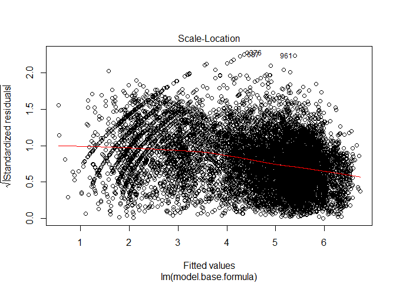<!-- -->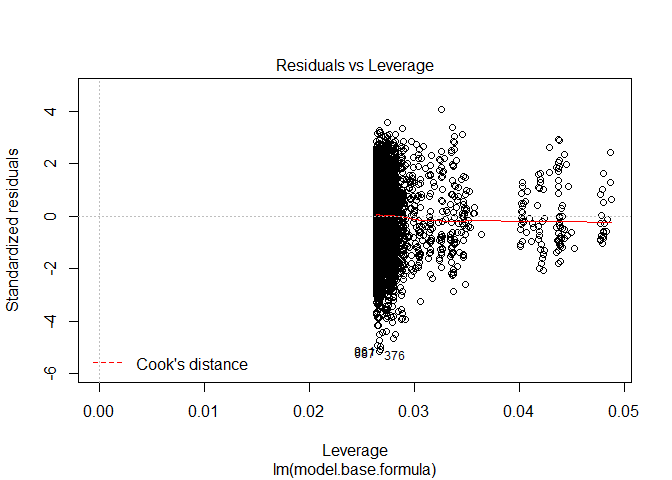<!-- -->

``` r
summary(model)
```

    ## 
    ## Call:
    ## lm(formula = model.base.formula, data = train)
    ## 
    ## Residuals:
    ##     Min      1Q  Median      3Q     Max 
    ## -3.3107 -0.3712  0.0243  0.4000  2.6134 
    ## 
    ## Coefficients:
    ##                   Estimate Std. Error t value Pr(>|t|)    
    ## (Intercept)      3.0511787  0.0485132  62.894  < 2e-16 ***
    ## weatherGood     -0.0890136  0.0147801  -6.023 1.77e-09 ***
    ## weatherAverage  -0.6658929  0.0240541 -27.683  < 2e-16 ***
    ## weatherPoor      0.0588950  0.6602034   0.089 0.928919    
    ## windspeed       -0.0030600  0.0008236  -3.716 0.000204 ***
    ## temp             0.0393263  0.0019318  20.358  < 2e-16 ***
    ## month.L          0.7637445  0.1068417   7.148 9.37e-13 ***
    ## month.Q         -0.2718168  0.1126754  -2.412 0.015865 *  
    ## month.C          0.1203118  0.1063336   1.131 0.257889    
    ## month^4          0.0804211  0.1064298   0.756 0.449890    
    ## month^5         -0.0866774  0.1059691  -0.818 0.413405    
    ## month^6         -0.1493309  0.1057199  -1.413 0.157828    
    ## month^7          0.2560829  0.1057124   2.422 0.015433 *  
    ## month^8         -0.0236326  0.1056947  -0.224 0.823079    
    ## month^9          0.0748846  0.1056753   0.709 0.478570    
    ## month^10         0.0483181  0.1056782   0.457 0.647523    
    ## month^11        -0.1109888  0.1057016  -1.050 0.293733    
    ## hour01          -0.6228965  0.0433194 -14.379  < 2e-16 ***
    ## hour02          -1.1257215  0.0438513 -25.671  < 2e-16 ***
    ## hour03          -1.6201615  0.0448488 -36.125  < 2e-16 ***
    ## hour04          -1.9127966  0.0453377 -42.190  < 2e-16 ***
    ## hour05          -0.9216814  0.0435975 -21.141  < 2e-16 ***
    ## hour06           0.2922717  0.0433693   6.739 1.68e-11 ***
    ## hour07           1.2798783  0.0432873  29.567  < 2e-16 ***
    ## hour08           1.9071649  0.0432159  44.131  < 2e-16 ***
    ## hour09           1.5814366  0.0432420  36.572  < 2e-16 ***
    ## hour10           1.2561663  0.0433297  28.991  < 2e-16 ***
    ## hour11           1.3768141  0.0434874  31.660  < 2e-16 ***
    ## hour12           1.5667233  0.0436582  35.886  < 2e-16 ***
    ## hour13           1.5408435  0.0438874  35.109  < 2e-16 ***
    ## hour14           1.4585644  0.0440775  33.091  < 2e-16 ***
    ## hour15           1.5171904  0.0441439  34.369  < 2e-16 ***
    ## hour16           1.7782752  0.0441085  40.316  < 2e-16 ***
    ## hour17           2.1929607  0.0439465  49.901  < 2e-16 ***
    ## hour18           2.1080655  0.0437727  48.159  < 2e-16 ***
    ## hour19           1.8100438  0.0435029  41.607  < 2e-16 ***
    ## hour20           1.5087460  0.0433511  34.803  < 2e-16 ***
    ## hour21           1.2463601  0.0432427  28.822  < 2e-16 ***
    ## hour22           1.0011746  0.0432020  23.174  < 2e-16 ***
    ## hour23           0.6021211  0.0431793  13.945  < 2e-16 ***
    ## month.L:hour01  -0.1084341  0.1503578  -0.721 0.470819    
    ## month.Q:hour01   0.0993944  0.1502700   0.661 0.508345    
    ## month.C:hour01   0.0720551  0.1505078   0.479 0.632129    
    ## month^4:hour01  -0.0529804  0.1501871  -0.353 0.724274    
    ## month^5:hour01  -0.0266039  0.1498215  -0.178 0.859064    
    ## month^6:hour01   0.0692080  0.1498594   0.462 0.644220    
    ## month^7:hour01  -0.1655290  0.1498543  -1.105 0.269358    
    ## month^8:hour01   0.0309278  0.1500252   0.206 0.836677    
    ## month^9:hour01  -0.1743399  0.1501545  -1.161 0.245640    
    ## month^10:hour01  0.0313280  0.1498490   0.209 0.834402    
    ## month^11:hour01  0.0586980  0.1495225   0.393 0.694646    
    ## month.L:hour02  -0.4193804  0.1535884  -2.731 0.006333 ** 
    ## month.Q:hour02   0.3262708  0.1527969   2.135 0.032758 *  
    ## month.C:hour02  -0.0139699  0.1529902  -0.091 0.927246    
    ## month^4:hour02   0.0941105  0.1529050   0.615 0.538249    
    ## month^5:hour02  -0.0811633  0.1517777  -0.535 0.592833    
    ## month^6:hour02   0.1006008  0.1512921   0.665 0.506101    
    ## month^7:hour02  -0.2697906  0.1520674  -1.774 0.076067 .  
    ## month^8:hour02  -0.0954893  0.1520542  -0.628 0.530021    
    ## month^9:hour02  -0.1987819  0.1510227  -1.316 0.188123    
    ## month^10:hour02 -0.0819950  0.1502232  -0.546 0.585201    
    ## month^11:hour02 -0.0644893  0.1496859  -0.431 0.666600    
    ## month.L:hour03  -0.6490202  0.1594284  -4.071 4.72e-05 ***
    ## month.Q:hour03   0.5952392  0.1577548   3.773 0.000162 ***
    ## month.C:hour03  -0.2640598  0.1570828  -1.681 0.092788 .  
    ## month^4:hour03  -0.0557246  0.1568028  -0.355 0.722312    
    ## month^5:hour03   0.0029344  0.1567791   0.019 0.985067    
    ## month^6:hour03   0.2746659  0.1563660   1.757 0.079022 .  
    ## month^7:hour03  -0.0681015  0.1549065  -0.440 0.660215    
    ## month^8:hour03  -0.1232975  0.1537627  -0.802 0.422647    
    ## month^9:hour03  -0.1608399  0.1529868  -1.051 0.293130    
    ## month^10:hour03 -0.2142686  0.1517038  -1.412 0.157858    
    ## month^11:hour03 -0.0144915  0.1504297  -0.096 0.923257    
    ## month.L:hour04  -0.2527183  0.1609657  -1.570 0.116442    
    ## month.Q:hour04   0.4957325  0.1571492   3.155 0.001612 ** 
    ## month.C:hour04  -0.0879155  0.1579437  -0.557 0.577795    
    ## month^4:hour04  -0.0543847  0.1587403  -0.343 0.731905    
    ## month^5:hour04  -0.2379258  0.1584522  -1.502 0.133240    
    ## month^6:hour04   0.1612802  0.1586833   1.016 0.309479    
    ## month^7:hour04  -0.1595042  0.1580506  -1.009 0.312904    
    ## month^8:hour04   0.0034642  0.1572027   0.022 0.982419    
    ## month^9:hour04  -0.0403687  0.1557169  -0.259 0.795452    
    ## month^10:hour04 -0.0414101  0.1527243  -0.271 0.786287    
    ## month^11:hour04  0.1979631  0.1502303   1.318 0.187623    
    ## month.L:hour05  -0.0547990  0.1519350  -0.361 0.718350    
    ## month.Q:hour05   0.1984807  0.1517861   1.308 0.191026    
    ## month.C:hour05  -0.0377831  0.1513367  -0.250 0.802853    
    ## month^4:hour05  -0.0017842  0.1512984  -0.012 0.990591    
    ## month^5:hour05  -0.1817907  0.1509769  -1.204 0.228579    
    ## month^6:hour05   0.1430050  0.1507447   0.949 0.342817    
    ## month^7:hour05  -0.0591668  0.1505263  -0.393 0.694279    
    ## month^8:hour05  -0.0339662  0.1502489  -0.226 0.821154    
    ## month^9:hour05  -0.1415208  0.1498785  -0.944 0.345070    
    ## month^10:hour05 -0.0201406  0.1495835  -0.135 0.892895    
    ## month^11:hour05  0.1590093  0.1497677   1.062 0.288394    
    ## month.L:hour06  -0.0921747  0.1504811  -0.613 0.540198    
    ## month.Q:hour06   0.0047472  0.1505528   0.032 0.974846    
    ## month.C:hour06   0.0643796  0.1503335   0.428 0.668482    
    ## month^4:hour06  -0.1851264  0.1501054  -1.233 0.217488    
    ## month^5:hour06  -0.2786030  0.1499437  -1.858 0.063190 .  
    ## month^6:hour06   0.0477320  0.1497711   0.319 0.749961    
    ## month^7:hour06  -0.0375607  0.1496574  -0.251 0.801836    
    ## month^8:hour06   0.0007723  0.1495074   0.005 0.995878    
    ## month^9:hour06   0.0188456  0.1494567   0.126 0.899660    
    ## month^10:hour06  0.0279977  0.1494620   0.187 0.851411    
    ## month^11:hour06  0.2666245  0.1494506   1.784 0.074448 .  
    ## month.L:hour07  -0.0647573  0.1501200  -0.431 0.666208    
    ## month.Q:hour07   0.1128475  0.1502260   0.751 0.452558    
    ## month.C:hour07   0.1630625  0.1500983   1.086 0.277340    
    ## month^4:hour07  -0.3094520  0.1498588  -2.065 0.038952 *  
    ## month^5:hour07  -0.2170165  0.1496608  -1.450 0.147073    
    ## month^6:hour07   0.0446469  0.1495253   0.299 0.765258    
    ## month^7:hour07  -0.1012943  0.1495063  -0.678 0.498088    
    ## month^8:hour07  -0.0235986  0.1494412  -0.158 0.874529    
    ## month^9:hour07  -0.0701061  0.1494385  -0.469 0.638986    
    ## month^10:hour07  0.0683892  0.1494541   0.458 0.647254    
    ## month^11:hour07  0.2347672  0.1494537   1.571 0.116251    
    ## month.L:hour08  -0.2896497  0.1499301  -1.932 0.053399 .  
    ## month.Q:hour08   0.3813627  0.1500143   2.542 0.011031 *  
    ## month.C:hour08   0.2967474  0.1498802   1.980 0.047741 *  
    ## month^4:hour08  -0.3990970  0.1497224  -2.666 0.007697 ** 
    ## month^5:hour08  -0.1410921  0.1495851  -0.943 0.345589    
    ## month^6:hour08   0.0558133  0.1494968   0.373 0.708902    
    ## month^7:hour08  -0.0995367  0.1494640  -0.666 0.505453    
    ## month^8:hour08  -0.0739363  0.1494555  -0.495 0.620819    
    ## month^9:hour08  -0.0921710  0.1494393  -0.617 0.537394    
    ## month^10:hour08 -0.0174085  0.1494458  -0.116 0.907269    
    ## month^11:hour08  0.1956066  0.1494746   1.309 0.190689    
    ## month.L:hour09  -0.3518939  0.1499281  -2.347 0.018939 *  
    ## month.Q:hour09   0.4875995  0.1500329   3.250 0.001158 ** 
    ## month.C:hour09   0.1993267  0.1498714   1.330 0.183552    
    ## month^4:hour09  -0.3904590  0.1497259  -2.608 0.009125 ** 
    ## month^5:hour09  -0.0948916  0.1495948  -0.634 0.525883    
    ## month^6:hour09   0.1086241  0.1494925   0.727 0.467475    
    ## month^7:hour09  -0.1194051  0.1494546  -0.799 0.424344    
    ## month^8:hour09  -0.0232142  0.1494415  -0.155 0.876556    
    ## month^9:hour09  -0.0649683  0.1494483  -0.435 0.663774    
    ## month^10:hour09 -0.0348472  0.1494355  -0.233 0.815617    
    ## month^11:hour09  0.1547961  0.1494544   1.036 0.300347    
    ## month.L:hour10  -0.2534970  0.1499231  -1.691 0.090896 .  
    ## month.Q:hour10   0.3806961  0.1500434   2.537 0.011187 *  
    ## month.C:hour10   0.0823976  0.1498691   0.550 0.582470    
    ## month^4:hour10  -0.3201929  0.1497205  -2.139 0.032491 *  
    ## month^5:hour10  -0.1695120  0.1496036  -1.133 0.257209    
    ## month^6:hour10   0.1796661  0.1495076   1.202 0.229500    
    ## month^7:hour10  -0.1308673  0.1494631  -0.876 0.381277    
    ## month^8:hour10  -0.0251589  0.1494464  -0.168 0.866313    
    ## month^9:hour10  -0.0996114  0.1494411  -0.667 0.505068    
    ## month^10:hour10 -0.0786841  0.1494415  -0.527 0.598538    
    ## month^11:hour10  0.1323401  0.1494407   0.886 0.375870    
    ## month.L:hour11  -0.2077424  0.1499110  -1.386 0.165846    
    ## month.Q:hour11   0.3642191  0.1500482   2.427 0.015226 *  
    ## month.C:hour11   0.1278582  0.1498684   0.853 0.393603    
    ## month^4:hour11  -0.2925527  0.1497149  -1.954 0.050720 .  
    ## month^5:hour11  -0.1543981  0.1495951  -1.032 0.302046    
    ## month^6:hour11   0.2119554  0.1495115   1.418 0.156322    
    ## month^7:hour11  -0.1181606  0.1494567  -0.791 0.429195    
    ## month^8:hour11   0.0141017  0.1494507   0.094 0.924828    
    ## month^9:hour11  -0.0872540  0.1494420  -0.584 0.559324    
    ## month^10:hour11 -0.0710608  0.1494422  -0.476 0.634435    
    ## month^11:hour11  0.1495891  0.1494520   1.001 0.316890    
    ## month.L:hour12  -0.2152760  0.1496925  -1.438 0.150429    
    ## month.Q:hour12   0.3677051  0.1497853   2.455 0.014109 *  
    ## month.C:hour12   0.2144990  0.1496555   1.433 0.151806    
    ## month^4:hour12  -0.2930620  0.1495798  -1.959 0.050112 .  
    ## month^5:hour12  -0.1585736  0.1495230  -1.061 0.288928    
    ## month^6:hour12   0.2159615  0.1494809   1.445 0.148560    
    ## month^7:hour12  -0.1180381  0.1494517  -0.790 0.429658    
    ## month^8:hour12  -0.0169153  0.1494743  -0.113 0.909902    
    ## month^9:hour12  -0.1242211  0.1494450  -0.831 0.405870    
    ## month^10:hour12 -0.0165629  0.1494395  -0.111 0.911751    
    ## month^11:hour12  0.1468797  0.1494479   0.983 0.325721    
    ## month.L:hour13  -0.2936353  0.1496726  -1.962 0.049806 *  
    ## month.Q:hour13   0.4198069  0.1497689   2.803 0.005072 ** 
    ## month.C:hour13   0.1836303  0.1496565   1.227 0.219846    
    ## month^4:hour13  -0.2727828  0.1495752  -1.824 0.068223 .  
    ## month^5:hour13  -0.2174957  0.1495462  -1.454 0.145873    
    ## month^6:hour13   0.1967161  0.1494864   1.316 0.188221    
    ## month^7:hour13  -0.0976541  0.1494512  -0.653 0.513501    
    ## month^8:hour13  -0.0395086  0.1494619  -0.264 0.791524    
    ## month^9:hour13  -0.1202803  0.1494412  -0.805 0.420915    
    ## month^10:hour13  0.0181451  0.1494571   0.121 0.903371    
    ## month^11:hour13  0.0708592  0.1494398   0.474 0.635392    
    ## month.L:hour14  -0.2499617  0.1496641  -1.670 0.094919 .  
    ## month.Q:hour14   0.3831495  0.1497517   2.559 0.010524 *  
    ## month.C:hour14   0.1165625  0.1496676   0.779 0.436110    
    ## month^4:hour14  -0.2905706  0.1495760  -1.943 0.052088 .  
    ## month^5:hour14  -0.2250167  0.1495304  -1.505 0.132400    
    ## month^6:hour14   0.2634937  0.1494882   1.763 0.077991 .  
    ## month^7:hour14  -0.0898878  0.1494603  -0.601 0.547576    
    ## month^8:hour14   0.0418026  0.1494582   0.280 0.779718    
    ## month^9:hour14  -0.1381735  0.1494438  -0.925 0.355203    
    ## month^10:hour14 -0.0663362  0.1494378  -0.444 0.657121    
    ## month^11:hour14  0.1219417  0.1494500   0.816 0.414555    
    ## month.L:hour15  -0.2000430  0.1496625  -1.337 0.181373    
    ## month.Q:hour15   0.3934790  0.1497474   2.628 0.008611 ** 
    ## month.C:hour15   0.0647145  0.1496727   0.432 0.665479    
    ## month^4:hour15  -0.3037797  0.1495752  -2.031 0.042285 *  
    ## month^5:hour15  -0.2075434  0.1495144  -1.388 0.165131    
    ## month^6:hour15   0.2701570  0.1494747   1.807 0.070732 .  
    ## month^7:hour15  -0.0603495  0.1494542  -0.404 0.686369    
    ## month^8:hour15  -0.0452909  0.1494524  -0.303 0.761861    
    ## month^9:hour15  -0.0963721  0.1494744  -0.645 0.519110    
    ## month^10:hour15 -0.0690914  0.1494432  -0.462 0.643857    
    ## month^11:hour15  0.1195241  0.1494406   0.800 0.423839    
    ## month.L:hour16  -0.1289548  0.1496759  -0.862 0.388949    
    ## month.Q:hour16   0.3162964  0.1497485   2.112 0.034694 *  
    ## month.C:hour16   0.0423430  0.1496688   0.283 0.777251    
    ## month^4:hour16  -0.2431650  0.1495784  -1.626 0.104050    
    ## month^5:hour16  -0.1983732  0.1495271  -1.327 0.184646    
    ## month^6:hour16   0.1997532  0.1494690   1.336 0.181441    
    ## month^7:hour16  -0.0156505  0.1494501  -0.105 0.916600    
    ## month^8:hour16  -0.0100324  0.1494471  -0.067 0.946479    
    ## month^9:hour16  -0.1055523  0.1494507  -0.706 0.480037    
    ## month^10:hour16  0.0003027  0.1494498   0.002 0.998384    
    ## month^11:hour16  0.1802694  0.1494540   1.206 0.227773    
    ## month.L:hour17  -0.2229924  0.1496730  -1.490 0.136290    
    ## month.Q:hour17   0.1681306  0.1497796   1.123 0.261667    
    ## month.C:hour17   0.0556435  0.1496662   0.372 0.710061    
    ## month^4:hour17  -0.3335074  0.1495834  -2.230 0.025797 *  
    ## month^5:hour17  -0.1789363  0.1495176  -1.197 0.231428    
    ## month^6:hour17   0.2079143  0.1494654   1.391 0.164239    
    ## month^7:hour17  -0.0689397  0.1494538  -0.461 0.644609    
    ## month^8:hour17   0.0173086  0.1494546   0.116 0.907804    
    ## month^9:hour17  -0.0612257  0.1494672  -0.410 0.682088    
    ## month^10:hour17  0.0641938  0.1494389   0.430 0.667520    
    ## month^11:hour17  0.1830849  0.1494681   1.225 0.220637    
    ## month.L:hour18  -0.2609261  0.1498943  -1.741 0.081760 .  
    ## month.Q:hour18   0.0947852  0.1500248   0.632 0.527533    
    ## month.C:hour18   0.0737370  0.1498842   0.492 0.622758    
    ## month^4:hour18  -0.2616709  0.1497110  -1.748 0.080521 .  
    ## month^5:hour18  -0.1157328  0.1495847  -0.774 0.439129    
    ## month^6:hour18   0.2304849  0.1494933   1.542 0.123159    
    ## month^7:hour18  -0.1166155  0.1494616  -0.780 0.435269    
    ## month^8:hour18   0.0087784  0.1494584   0.059 0.953164    
    ## month^9:hour18  -0.0823198  0.1494385  -0.551 0.581741    
    ## month^10:hour18  0.0835054  0.1494391   0.559 0.576316    
    ## month^11:hour18  0.1563581  0.1494698   1.046 0.295546    
    ## month.L:hour19  -0.2131190  0.1496739  -1.424 0.154508    
    ## month.Q:hour19   0.0256418  0.1497556   0.171 0.864050    
    ## month.C:hour19   0.0246447  0.1496839   0.165 0.869227    
    ## month^4:hour19  -0.0861638  0.1495928  -0.576 0.564635    
    ## month^5:hour19  -0.1264213  0.1495188  -0.846 0.397839    
    ## month^6:hour19   0.2514464  0.1494636   1.682 0.092536 .  
    ## month^7:hour19  -0.1259407  0.1494496  -0.843 0.399417    
    ## month^8:hour19  -0.0680161  0.1494479  -0.455 0.649035    
    ## month^9:hour19  -0.1213215  0.1494397  -0.812 0.416901    
    ## month^10:hour19  0.0164536  0.1494405   0.110 0.912331    
    ## month^11:hour19  0.0976870  0.1494551   0.654 0.513370    
    ## month.L:hour20  -0.1510747  0.1496623  -1.009 0.312788    
    ## month.Q:hour20  -0.0483332  0.1497140  -0.323 0.746825    
    ## month.C:hour20  -0.0039170  0.1496669  -0.026 0.979121    
    ## month^4:hour20  -0.0530473  0.1495776  -0.355 0.722861    
    ## month^5:hour20  -0.0716028  0.1495186  -0.479 0.632028    
    ## month^6:hour20   0.1236770  0.1494672   0.827 0.407999    
    ## month^7:hour20  -0.1096009  0.1494611  -0.733 0.463387    
    ## month^8:hour20   0.0294839  0.1494408   0.197 0.843601    
    ## month^9:hour20  -0.0388330  0.1494525  -0.260 0.794996    
    ## month^10:hour20 -0.0256089  0.1494490  -0.171 0.863948    
    ## month^11:hour20  0.1027897  0.1494707   0.688 0.491662    
    ## month.L:hour21  -0.1783670  0.1496816  -1.192 0.233428    
    ## month.Q:hour21  -0.0879472  0.1496993  -0.587 0.556886    
    ## month.C:hour21  -0.0007455  0.1496610  -0.005 0.996026    
    ## month^4:hour21  -0.0614499  0.1495810  -0.411 0.681218    
    ## month^5:hour21  -0.0198955  0.1495144  -0.133 0.894143    
    ## month^6:hour21   0.0508804  0.1494767   0.340 0.733570    
    ## month^7:hour21  -0.1620916  0.1494555  -1.085 0.278147    
    ## month^8:hour21   0.0530458  0.1494381   0.355 0.722620    
    ## month^9:hour21  -0.0974433  0.1494515  -0.652 0.514411    
    ## month^10:hour21 -0.0501299  0.1494376  -0.335 0.737287    
    ## month^11:hour21  0.1085894  0.1494567   0.727 0.467511    
    ## month.L:hour22  -0.1512940  0.1496541  -1.011 0.312060    
    ## month.Q:hour22  -0.0873714  0.1496967  -0.584 0.559464    
    ## month.C:hour22   0.0009214  0.1496684   0.006 0.995088    
    ## month^4:hour22  -0.0960059  0.1495903  -0.642 0.521022    
    ## month^5:hour22  -0.0209003  0.1495231  -0.140 0.888837    
    ## month^6:hour22   0.0403152  0.1494729   0.270 0.787384    
    ## month^7:hour22  -0.0536067  0.1494499  -0.359 0.719832    
    ## month^8:hour22   0.0061430  0.1494417   0.041 0.967212    
    ## month^9:hour22  -0.0523845  0.1494383  -0.351 0.725938    
    ## month^10:hour22 -0.0385468  0.1494417  -0.258 0.796459    
    ## month^11:hour22  0.0768088  0.1494487   0.514 0.607299    
    ## month.L:hour23  -0.0093870  0.1496536  -0.063 0.949987    
    ## month.Q:hour23  -0.1342656  0.1496937  -0.897 0.369774    
    ## month.C:hour23   0.0088228  0.1496679   0.059 0.952994    
    ## month^4:hour23  -0.0504625  0.1495934  -0.337 0.735874    
    ## month^5:hour23  -0.0252577  0.1495185  -0.169 0.865858    
    ## month^6:hour23  -0.0158995  0.1494634  -0.106 0.915285    
    ## month^7:hour23  -0.0728308  0.1494464  -0.487 0.626030    
    ## month^8:hour23  -0.0525847  0.1494577  -0.352 0.724968    
    ## month^9:hour23  -0.0408003  0.1494442  -0.273 0.784848    
    ## month^10:hour23 -0.0059593  0.1494363  -0.040 0.968191    
    ## month^11:hour23  0.0825311  0.1494441   0.552 0.580786    
    ## ---
    ## Signif. codes:  0 '***' 0.001 '**' 0.01 '*' 0.05 '.' 0.1 ' ' 1
    ## 
    ## Residual standard error: 0.6514 on 10487 degrees of freedom
    ## Multiple R-squared:  0.7971, Adjusted R-squared:  0.7914 
    ## F-statistic: 141.1 on 292 and 10487 DF,  p-value: < 2.2e-16

``` r
ols_plot_resid_lev(model)
```

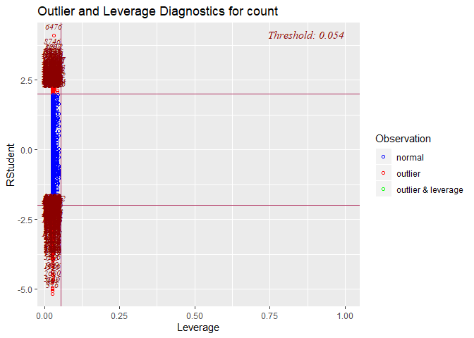<!-- -->

### RMSLE: Root Mean Squared Logarithmic Error Loss

``` r
RMSLE(y_pred = floor(ifelse(model$fitted.values < 0, 0, model$fitted.values)), y_true = train$count)
```

    ## [1] 0.1923972

``` r
## To test in Kaggle, submit the produced "submit" file
test$count <- predict.lm(model, test)


test$count <- exp(test$count)

# when less that 0, replace
test <- test %>%
  mutate(count = round(ifelse(count < 0, 0, count)))
         
# submit <- test %>% subset(select=c(datetime, count))
# write.csv(submit, file = "./kaggle_submission.csv", row.names = F)

# Kaggle Score:  RMSLE = 0.67458
score = (1 - (2445 / 3246)) * 100

score
```

    ## [1] 24.67652
