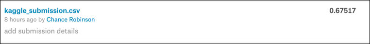
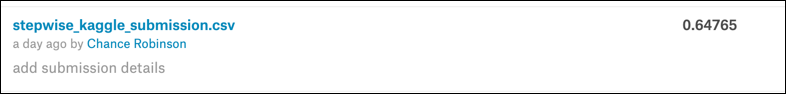

```{r, lib-read, results='hide', message=FALSE, include=FALSE, echo=FALSE}
setwd('.')

# library imports
library(tidyverse)
# Date manipulation
library(lubridate)
# Plotting
library(olsrr)
# RMLSE
library(MLmetrics)
# Correlation Matrix
library(ggcorrplot)
# Lasso
library(glmnet)
# AIC commands
library(MASS)
# Time Series Analysis
library(tseries)
library(forecast)
```


```{r, load-data, results='hide', message=FALSE, include=FALSE, echo=FALSE}
# seed data
set.seed(12345)

# read from csv into test and train data sets
train <- read_csv('./data/train.csv')
test <- read_csv('./data/test.csv')

```


# Introduction

[Intro]


# Data Description

The dataset we chose for this project was a publicly shared, hourly bike sharing dataset made available through Kaggle in csv format. 

This data set is divided into two distinct sets – a train and test set. The train set consists of 10,886 rows (titled "train.csv") and the test set consists of 6,493 rows (titled "test.csv"). Within the training set, the first 19 days of each month are captured whereas in the test data set, the 20th day to the end of each month is present. The entirity of the data spans from 1/1/2011 through 12/31/2012 - encompassing two full years of bike sharing data. Interstingly, the time component of this analysis is captured in hours of each day meaning we have a calendar date represented 24 times (for each hour of that day) in the data, along with it's associated attribute values.

In train data set, there are a total of 12 attributes which capture multiple variables related to bike rentals. Some of these attributes are categorical, and others are continuous. All attributes are summarized in the table below:

  Column Name      |Type                  |Description
  -----------------|--------------------- |------------------------------------------------
  1.  datetime     |    Date			        |YYYY-MM-DD HH24 (example:  2011-01-01 04:00:00)
  2.  season       |    Integer 		      |(1-4)
  3.  holiday      |    Integer 		      |(0 or 1)
  4.  workingday   |    Integer 		      |(0 or 1)
  5.  weather      |    Integer 		      |(1-4)
  6.  temp         |    Float 			      |temparture in Celcius
  7.  atemp        |    Float 			      |"feels like" temperature in Celsius
  8.  humidity     |    Integer           |relative humidity
  9.  windspeed    |    Float             |wind speed
  10. casual       |    Integer 		      |count of casual users 
  11. registered   |    Integer 		      |count of registered users 
  12. count        |    Integer 		      |count of total users (*response variable*)
  

*Note that the test data set lacks the casual, registered and count variables.*


\newpage

# Exploratory Data Analysis


## Plotting against Response Variable


```{r, categorical-factors, results='hide', message=FALSE, include=FALSE, echo=FALSE}

# copy the test and train data sets for EDA
train.mod.1 <- train
test.mod.1 <- test

train.mod.1$season <- factor(train.mod.1$season, labels = c("Spring", "Summer", "Fall", "Winter"))
test.mod.1$season <- factor(test.mod.1$season, labels = c("Spring", "Summer", "Fall", "Winter"))

table(train.mod.1$season)

train.mod.1$holiday <- factor(train.mod.1$holiday, labels = c("No", "Yes"))
test.mod.1$holiday <- factor(test.mod.1$holiday, labels = c("No", "Yes"))

table(train.mod.1$holiday)

train.mod.1$workingday <- factor(train.mod.1$workingday, labels = c("No", "Yes"))
test.mod.1$workingday <- factor(test.mod.1$workingday, labels = c("No", "Yes"))

table(train.mod.1$workingday)

train.mod.1$weather <- factor(train.mod.1$weather, labels = c("Great", "Good", "Average", "Poor"))
test.mod.1$weather <- factor(test.mod.1$weather, labels = c("Great", "Good", "Average", "Poor"))

table(train.mod.1$weather)


```


### Categorical Variables

Several numeric variables were found to be better suited to categorization and were converted to factors.

#### Season

Season           |Label                 |Description
-----------------|--------------------- |------------------------------------------------
1                | Spring               | Dec 21 ~ Mar 20
2                | Summer               | Mar 21 ~ Jun 20
3                | Fall                 | Jun 21 ~ Sep 20
4                | Winter               | Sep 21 ~ Dec 20

```{r, train.mod.1.season, echo=F}

# warning=F, fig.width=5, fig.height=5, fig.align='center', fig.cap='Count by Season', out.width = '45%', fig.pos="htbp", fig.show='hold'

train.mod.1 %>%
  ggplot(aes(x=season, y=count, fill=season)) + geom_boxplot()


```


\newpage

#### Holiday

```{r, train.mod.1.holiday, echo=F}

# warning=F, fig.width=5, fig.height=5, fig.align='center', fig.cap='Count by Holiday/ Non-Holiday', out.width = '45%', fig.pos="htbp", fig.show='hold'

train.mod.1 %>%
  ggplot(aes(x=holiday, y=count, fill=holiday)) + geom_boxplot()


```


#### Working Day


```{r, train.mod.1.workingday, echo=F}

# warning=F, fig.width=5, fig.height=5, fig.align='center', fig.cap='Count by Working Day/ Non-Working Day', out.width = '45%', fig.pos="htbp", fig.show='hold'

train.mod.1 %>%
  ggplot(aes(x=workingday, y=count, fill=workingday)) + geom_boxplot()


```


\newpage

#### Weather


```{r, train.mod.1.weather, echo=F}

# , warning=F, fig.width=5, fig.height=5, fig.align='center', fig.cap='Count by Weather Type', out.width = '45%', fig.pos="htbp", fig.show='hold'

train.mod.1 %>%
  ggplot(aes(x=weather, y=count, fill=weather)) + geom_boxplot()


```


```{r, split-date, results='hide', message=FALSE, include=FALSE, echo=FALSE}

# library(lubridate)

train.mod.1 <- train.mod.1 %>%
  mutate(year = as.factor(format(datetime, format = "%Y")), 
         month = as.numeric(format(datetime, format = "%m")), 
         day = as.factor(format(datetime, format = "%d")),
         hour = as.factor(format(datetime, format = "%H")))

test.mod.1 <- test.mod.1 %>%
  mutate(year = as.factor(format(datetime, format = "%Y")), 
         month = as.numeric(format(datetime, format = "%m")), 
         day = as.factor(format(datetime, format = "%d")),
         hour = as.factor(format(datetime, format = "%H")))


# train.mod.1
# test.mod.1

# Convert Months to Ordered Factor 
train.mod.1$month <-month(train.mod.1$datetime, label = TRUE, abbr = FALSE)
test.mod.1$month <-month(test.mod.1$datetime, label = TRUE, abbr = FALSE)

```


#### Count by Month

The datetime column was broken out into multiple factors as well so that we could visualize the components of each date and aggregate by different dimensions of the timestamp.  We felt this was also necessary due to the nature of how the train/ test data sets had been pre-split.  (i.e...with the first 19 days of the month holding the only true counts to validate our models against.)

* Year
* Month
* Day
* Hour


```{r, train.mod.1.month, echo=F}


# warning=F, fig.width=5, fig.height=5, fig.align='center', fig.cap='Count by Month', out.width = '45%', fig.pos="htbp", fig.show='hold'

train.mod.1 %>%
  ggplot(aes(x=month, y=count, fill=month)) + geom_boxplot() + 
  theme(axis.text.x = element_text(angle = 90, hjust = 1))


```


\newpage


### Continuous Variables

#### Count by Temperature

```{r, train.mod.1.temp, echo=FALSE}

train.mod.1 %>%
  ggplot(aes(x = temp, y = count)) + 
  geom_point(alpha = 0.3) + 
  scale_x_continuous(breaks = seq(from = 0, to = 45, by = 2)) + 
  geom_smooth(method = 'lm')

```


\newpage

#### Count by "Feels like" Temperature


```{r, train.mod.1.atemp, echo=FALSE}

train.mod.1 %>%
  ggplot(aes(x = atemp, y = count)) + 
  geom_point(alpha = 0.3) + 
  scale_x_continuous(breaks = seq(from = 0, to = 45, by = 2)) + 
  geom_smooth(method = 'lm')

```


\newpage

#### Count by Wind Speed


```{r, train.mod.1.windspeed, echo=FALSE}

train.mod.1 %>%
  ggplot(aes(x = windspeed, y = count)) + 
  geom_point(alpha = 0.3) + 
  scale_x_continuous(breaks = seq(from = 0, to = 60, by=2)) + 
  geom_smooth(method = 'lm')

```


\newpage

## Correlation Matrix

There are several variables with a relatively high level of covariance from the training set.  The following columns should therefore be removed so as not to be picked up by any automated modelling techniques. 

* atemp
* causual 
* registered


```{r, train.mod.1.corr.matrix, echo=FALSE}

train.mod.1.numeric <- train.mod.1 %>%
  select_if(is.numeric)


corr <- round(cor(train.mod.1.numeric), 1)
  
ggcorrplot(corr, method = "circle")


train.mod.1$atemp <- NULL
train.mod.1$casual <- NULL
train.mod.1$registered <- NULL

# train.mod.1


```


\newpage

# Objective I Analysis


## Question of Interest


The team be utilizing the multiple linear regression techniques we've learned up to this point in the program to predict the bike rental deman on a given date and time.  The model will be evaluated on the Root Mean Squared Logarithmic Error, or RMSLE.  As this data represents hourly data collected, there is an obvious time component associated with this particular competition.  We wanted to gauge how effective mutiple linear regression would be when the assumption of indepdence is clearly violated.


```{r remove-outliers, results='hide', message=FALSE, include=FALSE, echo=FALSE}

# log transform the response variable
train.mod.1$count <- log(train.mod.1$count)


train.mod.1 %>%
  group_by(month) %>%
  summarize(mean = mean(count), sd = sd(count), median = median(count), observations = n())


outliers <- train.mod.1[   train.mod.1$count < median(train.mod.1$count) - (sd(train.mod.1$count) * 3), ]


# remove outliers
train.mod.1 <- train.mod.1 %>%
  filter(!datetime %in% outliers$datetime)


train[5555, ] # 2012-01-09 18:00:00


train.mod.1 <- train.mod.1 %>%
  filter(datetime != '2012-01-09 18:00:00')


# train.mod.1  %>%
#   ggplot(aes(x=month, y=count, fill=month)) + geom_boxplot() + 
#   theme(axis.text.x = element_text(angle = 90, hjust = 1))

```


## Model Selection

### Lasso


```{r}

split.perc = .80

train.indices = sample(1:dim(train.mod.1)[1],round(split.perc * dim(train.mod.1)[1]))

train.mod.1.train = train.mod.1[train.indices,]
train.mod.1.test  = train.mod.1[-train.indices,]


train.mod.1.train$datetime <- NULL
train.mod.1.test$datetime <- NULL


train.mod.1.train

x <- model.matrix(count~.,train.mod.1.train)[,-7]
y <- train.mod.1.train$count

grid=10^seq(10,-2, length =100)
lasso.model <- glmnet(x,y,alpha=1, lambda=grid)

xtest<-model.matrix(count~.,train.mod.1.test)[,-7]
ytest <- train.mod.1.test$count


cv.out=cv.glmnet(x,y,alpha=1) #alpha=1 performs LASSO
plot(cv.out)
best.lambda <-cv.out$lambda.min  #Optimal penalty parameter.  You can make this call visually.
lasso.pred=predict(lasso.model ,s=best.lambda ,newx=xtest)

testMSE_LASSO <- mean((ytest-lasso.pred)^2)
testMSE_LASSO


```


### Custom Variable Selection 

We developed the best fitting model with a custom selection of variables after having accounted for those with high correlation and adding interactive terms such as month/ hour based on the seasonal nature that the box plots exhibited.

```{r, custom-model, echo=FALSE}

custom.model.formula = count ~ weather + 
                             windspeed + 
                             temp + 
                             month +
                             hour +
                             month:hour


custom.model  <- lm(formula = custom.model.formula, data = train.mod.1)

par(mfrow=c(2,2))
plot(custom.model)


cst.sm <- summary(custom.model)
cst.sm.coe <- cst.sm$coefficients

# get the CIs for the coefficients
cst.model.conf <- confint(custom.model)

# cst.sm
# cst.sm.coe
# cst.model.conf

ols_plot_resid_lev(custom.model)

```

#### Custom RMSLE
```{r, cutom-rmsle, echo=FALSE}

# Root Mean Squared Logarithmic Error Loss

RMSLE(y_pred = custom.model$fitted.values, y_true = train.mod.1$count)

```


#### Kaggle Score

The Root Mean Squared Logarithmic Error Loss (RMSLE) for the kaggle submission was 0.67517 for our custom model.  We scored better than around 24% of all public submission for the competition with this technique.


\label{objective-one:custom-kaggle}


```{r, custom-kaggle, echo=F, out.width='90%', fig.align='center'}

```


### Stepwise

```{r, stepwise-model, echo=FALSE}

train.mod.1$datetime <- NULL
train.mod.1$datetime <- NULL

# Fit the model with all parameters
fit1 <- lm(count ~ ., data=train.mod.1)
# Fit the model with only 1 parameter
fit2 <- lm(count ~ 1, data=train.mod.1)


# stw.model <- stepAIC(fit2,direction="both",scope=list(upper=fit1,lower=fit2))
# summary(stw.model)

stw.model.formula <- count ~ hour + month + year + weather + temp + humidity + workingday + windspeed + holiday

stw.model <- lm(stw.model.formula,
               data = train.mod.1)

stw.sm <- summary(stw.model)
stw.sm.coe <- stw.sm$coefficients

# get the CIs for the coefficients
stw.model.conf <- confint(stw.model)

# stw.sm
# stw.sm.coe
# stw.model.conf

# test$count <- predict.lm(stw.model, test.mod.1)
# test$count <- exp(test$count)

# when less that 0, replace
# test <- test %>%
#   mutate(count = round(ifelse(count < 0, 0, count)))

# submit <- test %>% subset(select=c(datetime, count))
# write.csv(submit, file = "./stepwise_kaggle_submission.csv", row.names = F)

```


#### Stepwise RMSLE


The Root Mean Squared Logarithmic Error Loss calculation against the train data set.

```{r, stepwise-rmsle, echo=FALSE}

# Root Mean Squared Logarithmic Error Loss

RMSLE(y_pred = stw.model $fitted.values, y_true = train.mod.1$count)

```


#### Kaggle Score

The Root Mean Squared Logarithmic Error Loss (RMSLE) for the kaggle submission was 0.64765 for our stepwise model.  We scored better than around 24% of all public submission for the competition with this technique, which was almost identical to that of the custom model with an interaction.


\label{objective-one:stepwise-kaggle}


```{r, stepwise-kaggle, echo=F, out.width='90%', fig.align='center'}

```


\newpage


## Model Assumptions Assessment

* The response variable is linear
* The data is normally distributed
* Independence

## Comparing Competing Models


\newpage

## Parameters

[Parameters]

## Model Interpretation

[Model Interpretation]


## Conclusion

[Conclusion]

\newpage

# Objective II Analysis


## Question of Interest


As the independence assumption from Objective I appears to have been violated, the team wanted to apply the time series analysis techniques we've learned up to this point in the MSDS program in an attempt to address.  The primary goal was to compare and contrast the performance of auto arima models versus those that we modeled on our own. 

Additionally, we wanted to compare the Kaggle submission to that from Objective I to see if our predictions were better or worse than from the prior objective.

## Data Preperation

As the data had been pre-split monthly, we needed to make our predictions from the 20th of each month and on for each year of recorded bike rentals.  (2011 and 2012)  The approach has been summarized with the steps below.


  1. Log the response variable
  
  2. Loop through years

  3. Loop through months

  4. Fit AR model

  5. Forcast x number of observations based on the number of rows from test dataframe and impute the count from the time series forecast


\newpage

## Comparing Competing Models
    

### Auto Arima


```{r, split-date-arima, results='hide', message=FALSE, include=FALSE, echo=FALSE}

# copy the test and train data sets for Objective 2
train.mod.2 <- train
test.mod.2 <- test

train.mod.2 <- train.mod.2 %>%
  mutate(year = as.factor(format(datetime, format = "%Y")), 
         month = as.numeric(format(datetime, format = "%m")), 
         day = as.factor(format(datetime, format = "%d")),
         hour = as.factor(format(datetime, format = "%H")))

test.mod.2 <- test.mod.2 %>%
  mutate(year = as.factor(format(datetime, format = "%Y")), 
         month = as.numeric(format(datetime, format = "%m")), 
         day = as.factor(format(datetime, format = "%d")),
         hour = as.factor(format(datetime, format = "%H")))

# Convert Months to Ordered Factor 
train.mod.2$month <-month(train.mod.2$datetime, label = TRUE, abbr = FALSE)
test.mod.2$month <-month(test.mod.2$datetime, label = TRUE, abbr = FALSE)

# train.mod.2
# test.mod.2

```

```{r auto-arima, results='hide', message=FALSE, include=FALSE, echo=FALSE}

train1arm <- train.mod.2 %>%
  filter(year == '2011' & month == 'January') 

test1arm <- test.mod.2 %>%
  filter(year == '2011' & month == 'January') %>%
  mutate(count = NA)

### Log the response variable
train1arm$count = log(train1arm$count)

autoarm <- auto.arima(train1arm$count, D=1)

number = nrow(test1arm)

acf(autoarm$residuals)
pacf(autoarm$residuals)

# checkresiduals(autoarm)

fcst <- forecast(autoarm, h=number)

# autoplot(fcst)

# point estimate (mean)
test1arm$count <- fcst$mean

RMSLE(y_pred = fcst$fitted, y_true = train1arm$count)

summary(autoarm)

```

```{r, auto-arima-plot-1, echo=F, warning=F, fig.width=5, fig.height=5, fig.align='center', fig.cap='Auto Arima Residual Plots', out.width = '45%', fig.pos="htbp", fig.show='hold'}

checkresiduals(autoarm)

```


```{r, auto-arima-plot-2, echo=F, warning=F, fig.width=5, fig.height=5, fig.align='center', fig.cap='Auto Arima Forecasts', out.width = '45%', fig.pos="htbp", fig.show='hold'}

autoplot(fcst)

```

\newpage


### Auto Regression


```{r, arima-25, results='hide', message=FALSE, include=FALSE, echo=FALSE}
train1 <- train.mod.2 %>%
  filter(year == '2011' & month == 'January') 

test1 <- test.mod.2 %>%
  filter(year == '2011' & month == 'January') %>%
  mutate(count = NA)


### Log the response variable
train1$count = log(train1$count)

AR25 <- arima(train1$count,order=c(25,0,0))

number = nrow(test1)

acf(AR25$residuals)
pacf(AR25$residuals)

# checkresiduals(AR25)

fcst <- forecast(AR25, h=number)

# autoplot(fcst)

# point estimate (mean)
test1$count <- fcst$mean


RMSLE(y_pred = fcst$fitted, y_true = train1$count)
summary(AR25)

```

```{r, arima-25-plot-1, echo=F, warning=F, fig.width=5, fig.height=5, fig.align='center', fig.cap='Arima (25) Residual Plots', out.width = '45%', fig.pos="htbp", fig.show='hold'}

checkresiduals(AR25)

```


```{r, arima-25-plot-2, echo=F, warning=F, fig.width=5, fig.height=5, fig.align='center', fig.cap='Arima (25) Forecasts', out.width = '45%', fig.pos="htbp", fig.show='hold'}

autoplot(fcst)

```

\newpage


#### Kaggle Score

The Root Mean Squared Logarithmic Error Loss (RMSLE) for the kaggle submission was 1.01847 for our AR25 model.  We scored better than only 14.48% of all public submission for the competition which was considerably worse than our score from both of the multiple linear regression models above.


\label{objective-two:ar25-kaggle}


```{r, ar25-kaggle, echo=F, out.width='90%', fig.align='center'}

```


## Model Assumption Assessment

Both the ARIMA and AR 25 models showed a constant mean and variance for the timespan of the observations.  The auto-correlations however were noticably better for the AR 25 graph.  The error terms were also slightly improved which is the reason we elected to not go with the automated selection approach.

* Constant Mean
* Constant Variance 
* Constant auto-correlations


## Conclusion


Although the data set was found to be serially correlated, ultimately applying time series techniques was not sufficient to improve our RMSLE above and beyond the multiple linear regression techniques from objective one.  Again, this likely had more to due with the fact that we were attempting to predict future observations 10 plus days in advance on a monthly basis.  And with the seasonal nature of our hourly observations, the accuracy of the preduction became less accurate over time and showed a regression to the mean after only a few days worth of predictions.  The immediate observations however, within 24 to 48 hours, visually at least showed much better predictive trends.  


\newpage

# Appendix


## Code

### R Code For Objective I

```{r, objective-one, eval=FALSE}


```

\newpage

### R Code For Objective II

```{r, objective-two, eval=FALSE}

### Library Imports

library(tidyverse)
# Date manipulation
library(lubridate)
# RMLSE
library(MLmetrics)
# Time Series Analysis
library(tseries)
library(forecast)


### Load the csv data
train <- read_csv('../../../data/train.csv')
test <- read_csv('../../../data/test.csv')


### Categorical Factors
train$season <- factor(train$season, labels = c("Spring", "Summer", "Fall", "Winter"))
test$season <- factor(test$season, labels = c("Spring", "Summer", "Fall", "Winter"))

table(train$season)

train$holiday <- factor(train$holiday, labels = c("No", "Yes"))
test$holiday <- factor(test$holiday, labels = c("No", "Yes"))

table(train$holiday)

train$workingday <- factor(train$workingday, labels = c("No", "Yes"))
test$workingday <- factor(test$workingday, labels = c("No", "Yes"))

table(train$workingday)

train$weather <- factor(train$weather, labels = c("Great", "Good", "Average", "Poor"))
test$weather <- factor(test$weather, labels = c("Great", "Good", "Average", "Poor"))

table(train$weather)


### Split Date-Time
train <- train %>%
  mutate(year = as.factor(format(datetime, format = "%Y")), 
         month = as.numeric(format(datetime, format = "%m")), 
         day = as.factor(format(datetime, format = "%d")),
         hour = as.factor(format(datetime, format = "%H")))

test <- test %>%
  mutate(year = as.factor(format(datetime, format = "%Y")), 
         month = as.numeric(format(datetime, format = "%m")), 
         day = as.factor(format(datetime, format = "%d")),
         hour = as.factor(format(datetime, format = "%H")))


### Convert months to ordinal factor
train$month <-month(train$datetime, label = TRUE, abbr = FALSE)
test$month <-month(test$datetime, label = TRUE, abbr = FALSE)


## 2011

### January

#### Auto Arima

train1arm <- train %>%
  filter(year == '2011' & month == 'January') %>%
  select(datetime, count)

test1arm <- test %>%
  filter(year == '2011' & month == 'January') %>%
  mutate(count = NA) %>%
  select(datetime, count)


### Log the response variable
train1arm$count = log(train1arm$count)


autoarm <- auto.arima(train1arm$count, D=1)


number = nrow(test1arm)

acf(autoarm$residuals)
pacf(autoarm$residuals)

checkresiduals(autoarm)

fcst <- forecast(autoarm, h=number)

autoplot(fcst)

# point estimate (mean)
test1arm$count <- fcst$mean

RMSLE(y_pred = fcst$fitted, y_true = train1arm$count)

summary(autoarm)


#### AR 25

train1 <- train %>%
  filter(year == '2011' & month == 'January') %>%
  select(datetime, count)

test1 <- test %>%
  filter(year == '2011' & month == 'January') %>%
  mutate(count = NA) %>%
  select(datetime, count)


### Log the response variable
train1$count = log(train1$count)


AR25 <- arima(train1$count,order=c(25,0,0))

number = nrow(test1)

acf(AR25$residuals)
pacf(AR25$residuals)

checkresiduals(AR25)

fcst <- forecast(AR25, h=number)

autoplot(fcst)

# point estimate (mean)
test1$count <- fcst$mean


RMSLE(y_pred = fcst$fitted, y_true = train1$count)
summary(AR25)


#
#
#

## 2012

### December

train24 <- train %>%
  filter(year == '2012' & month == 'December') %>%
  select(datetime, count)

test24 <- test %>%
  filter(year == '2012' & month == 'December') %>%
  mutate(count = NA) %>%
  select(datetime, count)


### Log the response variable
train24$count = log(train24$count)


AR25 <- arima(train24$count,order=c(25,0,0))

number = nrow(test24)

acf(AR25$residuals)
pacf(AR25$residuals)

checkresiduals(AR25)

fcst <- forecast(AR25, h=number)

autoplot(fcst)

# point estimate (mean)
test24$count <- fcst$mean


RMSLE(y_pred = fcst$fitted, y_true = train24$count)

summary(AR25)


### Combine all of the individual data frames

combined <- data.frame(datetime=character(),
                 count=double(), 
                 stringsAsFactors=FALSE) 


combined <- bind_rows(test1, test2, test3, test4, test5, 
                      test6, test7, test8, test9, test10, 
                      test11, test12,test13, test14, test15, 
                      test16, test17, test18, test19, test20, 
                      test21, test22, test23, test24)


combined <- combined %>%
  mutate(count = round(exp(count)))


# combined
# write.csv(combined, file = "./ts_kaggle_submission.csv", row.names = F)


```


\newpage

# References
