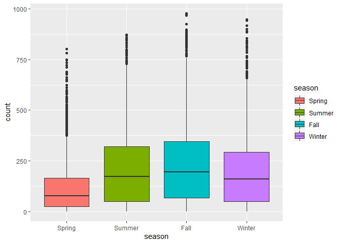
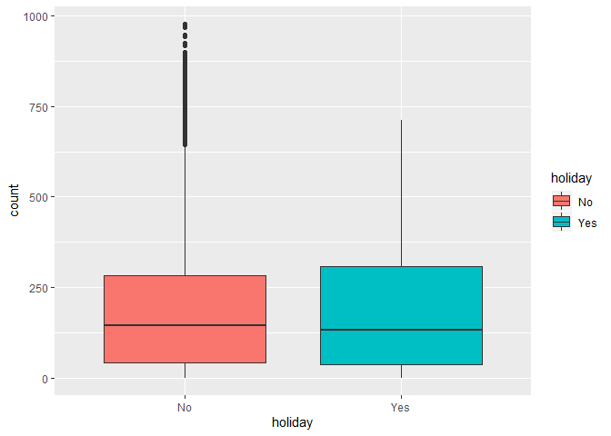
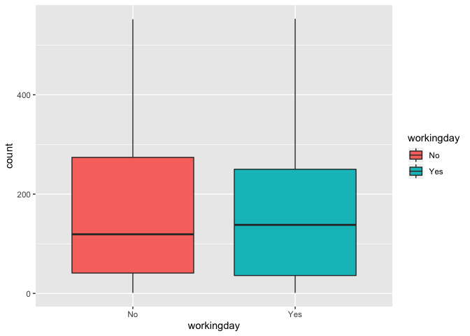
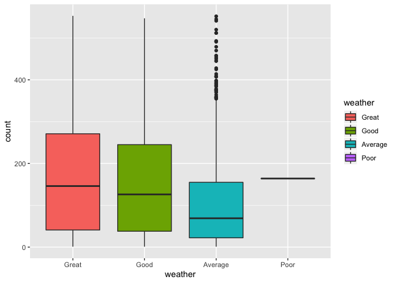
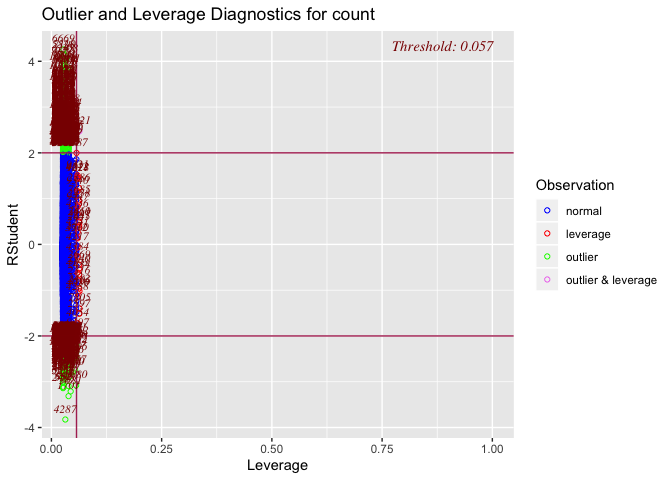

Exploratory\_Data\_Analysis
================
Chance Robinson
9/21/2019

  - [Exploratory Data Analysis](#exploratory-data-analysis)
      - [Library Imports](#library-imports)
      - [Load the csv data](#load-the-csv-data)
      - [Column Names (Train)](#column-names-train)
      - [Example Output (Train)](#example-output-train)
      - [Example output (Test)](#example-output-test)
      - [Identify Dimensions](#identify-dimensions)
      - [Missing Data (Both)](#missing-data-both)
      - [Data Dictionary](#data-dictionary)
      - [Factors](#factors)
      - [Split Date-Time (Both)](#split-date-time-both)
      - [Convert Months to Ordered Factor
        (Both)](#convert-months-to-ordered-factor-both)
      - [Count by Month (Train)](#count-by-month-train)
      - [Count by Month (Test)](#count-by-month-test)
      - [Days (Train)](#days-train)
      - [Days (Test)](#days-test)
      - [Explanatory Variable plots against Response
        Variable](#explanatory-variable-plots-against-response-variable)
      - [Model Fitting](#model-fitting)

## Exploratory Data Analysis

### Library Imports

``` r
library(tidyverse)
```

    ## -- Attaching packages ---------------------------------------------------------------------------------------------------------------- tidyverse 1.2.1 --

    ## v ggplot2 3.2.0     v purrr   0.3.2
    ## v tibble  2.1.3     v dplyr   0.8.3
    ## v tidyr   0.8.3     v stringr 1.4.0
    ## v readr   1.3.1     v forcats 0.4.0

    ## -- Conflicts ------------------------------------------------------------------------------------------------------------------- tidyverse_conflicts() --
    ## x dplyr::filter() masks stats::filter()
    ## x dplyr::lag()    masks stats::lag()

``` r
library(lubridate)
```

    ## 
    ## Attaching package: 'lubridate'

    ## The following object is masked from 'package:base':
    ## 
    ##     date

``` r
library(olsrr)
```

    ## 
    ## Attaching package: 'olsrr'

    ## The following object is masked from 'package:datasets':
    ## 
    ##     rivers

### Load the csv data

``` r
train <- read_csv('../../data/train.csv')
test <- read_csv('../../data/test.csv')
```

### Column Names (Train)

``` r
colnames(train)
```

    ##  [1] "datetime"   "season"     "holiday"    "workingday" "weather"   
    ##  [6] "temp"       "atemp"      "humidity"   "windspeed"  "casual"    
    ## [11] "registered" "count"

### Example Output (Train)

``` r
head(train)
```

    ## # A tibble: 6 x 12
    ##   datetime            season holiday workingday weather  temp atemp
    ##   <dttm>               <dbl>   <dbl>      <dbl>   <dbl> <dbl> <dbl>
    ## 1 2011-01-01 00:00:00      1       0          0       1  9.84  14.4
    ## 2 2011-01-01 01:00:00      1       0          0       1  9.02  13.6
    ## 3 2011-01-01 02:00:00      1       0          0       1  9.02  13.6
    ## 4 2011-01-01 03:00:00      1       0          0       1  9.84  14.4
    ## 5 2011-01-01 04:00:00      1       0          0       1  9.84  14.4
    ## 6 2011-01-01 05:00:00      1       0          0       2  9.84  12.9
    ## # ... with 5 more variables: humidity <dbl>, windspeed <dbl>,
    ## #   casual <dbl>, registered <dbl>, count <dbl>

### Example output (Test)

  - The test data set is missing 3 columns from the train data set
    (causal, registered and count)

<!-- end list -->

``` r
head(test)
```

    ## # A tibble: 6 x 9
    ##   datetime            season holiday workingday weather  temp atemp
    ##   <dttm>               <dbl>   <dbl>      <dbl>   <dbl> <dbl> <dbl>
    ## 1 2011-01-20 00:00:00      1       0          1       1 10.7   11.4
    ## 2 2011-01-20 01:00:00      1       0          1       1 10.7   13.6
    ## 3 2011-01-20 02:00:00      1       0          1       1 10.7   13.6
    ## 4 2011-01-20 03:00:00      1       0          1       1 10.7   12.9
    ## 5 2011-01-20 04:00:00      1       0          1       1 10.7   12.9
    ## 6 2011-01-20 05:00:00      1       0          1       1  9.84  11.4
    ## # ... with 2 more variables: humidity <dbl>, windspeed <dbl>

### Identify Dimensions

  - Train {“rows”: 10886, “columns”: 12}

  - Test {“rows”: 6493, “columns”: 9}

### Missing Data (Both)

  - No NA values can be found in either the training or test data sets

<!-- end list -->

``` r
# train
any(is.na(train))
```

    ## [1] FALSE

``` r
# test
any(is.na(test))
```

    ## [1] FALSE

### Data Dictionary

| Column Name     | Type Description |                                                |
| --------------- | ---------------- | ---------------------------------------------- |
| 1\. datetime    | Date             | YYYY-MM-DD HH24 (example: 2011-01-01 04:00:00) |
| 2\. season      | Integer          | (1-4)                                          |
| 3\. holiday     | Integer          | (0 or 1)                                       |
| 4\. workingday  | Integer          | (0 or 1)                                       |
| 5\. weather     | Integer          | (1-4)                                          |
| 6\. temp        | Float            | temparture in Celcius                          |
| 7\. atemp       | Float            | “feels like” temperature in Celsius            |
| 8\. humidity    | Integer          | relative humidity                              |
| 9\. windspeed   | Float            | wind speed                                     |
| 10\. casual     | Integer          | count of casual users                          |
| 11\. registered | Integer          | count of registered users                      |
| 12\. count      | Integer          | count of total users `response variable`       |

### Factors

  - season
      - 1 = Dec 21 \~ March 20 (Spring)
      - 2 = March 21 \~ Jun 20 (Summer)
      - 3 = June 21 \~ Sept 20 (Fall)
      - 4 = Sept 21 \~ Dec 20 (Winter)
  - holiday
      - 0 = No
      - 1 = Yes
  - workingday
      - 0 = No
      - 1 =
Yes

<!-- end list -->

``` r
train$season <- factor(train$season, labels = c("Spring", "Summer", "Fall", "Winter"))
test$season <- factor(test$season, labels = c("Spring", "Summer", "Fall", "Winter"))

table(train$season)
```

    ## 
    ## Spring Summer   Fall Winter 
    ##   2686   2733   2733   2734

``` r
train$holiday <- factor(train$holiday, labels = c("No", "Yes"))
test$holiday <- factor(test$holiday, labels = c("No", "Yes"))

table(train$holiday)
```

    ## 
    ##    No   Yes 
    ## 10575   311

``` r
train$workingday <- factor(train$workingday, labels = c("No", "Yes"))
test$workingday <- factor(test$workingday, labels = c("No", "Yes"))

table(train$workingday)
```

    ## 
    ##   No  Yes 
    ## 3474 7412

``` r
train$weather <- factor(train$weather, labels = c("Great", "Good", "Average", "Poor"))
test$weather <- factor(test$weather, labels = c("Great", "Good", "Average", "Poor"))


table(train$weather)
```

    ## 
    ##   Great    Good Average    Poor 
    ##    7192    2834     859       1

### Split Date-Time (Both)

  - Year, Month, Day and Hour

<!-- end list -->

``` r
library(lubridate)


train <- train %>%
  mutate(year = as.numeric(format(datetime, format = "%Y")), 
         month = as.numeric(format(datetime, format = "%m")), 
         day = as.numeric(format(datetime, format = "%d")),
         hour = as.numeric(format(datetime, format = "%H")))

test <- test %>%
  mutate(year = as.numeric(format(datetime, format = "%Y")), 
         month = as.numeric(format(datetime, format = "%m")), 
         day = as.numeric(format(datetime, format = "%d")),
         hour = as.numeric(format(datetime, format = "%H")))
```

### Convert Months to Ordered Factor (Both)

``` r
train$month <-month(train$datetime, label = TRUE, abbr = FALSE)
test$month <-month(test$datetime, label = TRUE, abbr = FALSE)
```

### Count by Month (Train)

  - The months seem to show an upward trend throughout the year
  - Increased popularity of Ride-Sharing program?

<!-- end list -->

``` r
train %>%
  ggplot(aes(x = month)) + 
  geom_bar() +
  theme(axis.text.x = element_text(angle = 90, hjust = 1))
```

<!-- -->

### Count by Month (Test)

  - Notice how the months with fewer days have fewer totals
    (i.e…February)

<!-- end list -->

``` r
test %>%
  ggplot(aes(x = month)) + 
  geom_bar() +
  theme(axis.text.x = element_text(angle = 90, hjust = 1))
```

<!-- -->

### Days (Train)

  - The train data set covers days from the 1st through the 19th

<!-- end list -->

``` r
train %>%
  ggplot(aes(x = day)) + 
  geom_bar()
```

<!-- -->

### Days (Test)

  - The test set covers days from the 20th through the 31st

<!-- end list -->

``` r
test %>%
  ggplot(aes(x = day)) + 
  geom_bar()
```

<!-- -->

``` r
head(train)
```

    ## # A tibble: 6 x 16
    ##   datetime            season holiday workingday weather  temp atemp
    ##   <dttm>              <fct>  <fct>   <fct>      <fct>   <dbl> <dbl>
    ## 1 2011-01-01 00:00:00 Spring No      No         Great    9.84  14.4
    ## 2 2011-01-01 01:00:00 Spring No      No         Great    9.02  13.6
    ## 3 2011-01-01 02:00:00 Spring No      No         Great    9.02  13.6
    ## 4 2011-01-01 03:00:00 Spring No      No         Great    9.84  14.4
    ## 5 2011-01-01 04:00:00 Spring No      No         Great    9.84  14.4
    ## 6 2011-01-01 05:00:00 Spring No      No         Good     9.84  12.9
    ## # ... with 9 more variables: humidity <dbl>, windspeed <dbl>,
    ## #   casual <dbl>, registered <dbl>, count <dbl>, year <dbl>, month <ord>,
    ## #   day <dbl>, hour <dbl>

### Explanatory Variable plots against Response Variable

``` r
train %>%
  ggplot(aes(x=season, y=count, fill=season)) + geom_boxplot()
```

<!-- -->

``` r
train %>%
  ggplot(aes(x=holiday, y=count, fill=holiday)) + geom_boxplot()
```

<!-- -->

``` r
train %>%
  ggplot(aes(x=workingday, y=count, fill=workingday)) + geom_boxplot()
```

<!-- -->

``` r
train %>%
  ggplot(aes(x=weather, y=count, fill=weather)) + geom_boxplot()
```

<!-- -->

``` r
# train[5632,]
# 
# train[7551,]
# 
# train[8625,]
# 

train[9911,]
```

    ## # A tibble: 1 x 16
    ##   datetime            season holiday workingday weather  temp atemp
    ##   <dttm>              <fct>  <fct>   <fct>      <fct>   <dbl> <dbl>
    ## 1 2012-10-17 07:00:00 Winter No      Yes        Great    14.8  18.2
    ## # ... with 9 more variables: humidity <dbl>, windspeed <dbl>,
    ## #   casual <dbl>, registered <dbl>, count <dbl>, year <dbl>, month <ord>,
    ## #   day <dbl>, hour <dbl>

``` r
train[9887,]
```

    ## # A tibble: 1 x 16
    ##   datetime            season holiday workingday weather  temp atemp
    ##   <dttm>              <fct>  <fct>   <fct>      <fct>   <dbl> <dbl>
    ## 1 2012-10-16 07:00:00 Winter No      Yes        Great    17.2  21.2
    ## # ... with 9 more variables: humidity <dbl>, windspeed <dbl>,
    ## #   casual <dbl>, registered <dbl>, count <dbl>, year <dbl>, month <ord>,
    ## #   day <dbl>, hour <dbl>

``` r
train <- train %>%
  filter(!datetime=='2012-01-09 18:00:00')
# 
# 
# testy <- train %>%
#   filter(month=='August' & day==1)
# 
# testy
```

### Model Fitting

``` r
model.base.formula = count ~ season + 
                             weather + 
                             windspeed + 
                             temp + 
                             year + 
                             month +
                             day + 
                             hour 
  
  # datetime


model  <- lm(formula = model.base.formula, data = train)

plot(model)
```

    ## Warning: not plotting observations with leverage one:
    ##   5632

<!-- --><!-- -->

    ## Warning: not plotting observations with leverage one:
    ##   5632

<!-- --><!-- -->

``` r
summary(model)
```

    ## 
    ## Call:
    ## lm(formula = model.base.formula, data = train)
    ## 
    ## Residuals:
    ##     Min      1Q  Median      3Q     Max 
    ## -352.21  -94.39  -27.95   65.74  644.11 
    ## 
    ## Coefficients: (3 not defined because of singularities)
    ##                  Estimate Std. Error t value Pr(>|t|)    
    ## (Intercept)    -1.683e+05  5.582e+03 -30.154  < 2e-16 ***
    ## seasonSummer   -1.482e+01  1.936e+01  -0.765 0.444093    
    ## seasonFall     -3.622e+01  2.046e+01  -1.771 0.076655 .  
    ## seasonWinter   -3.413e+01  1.897e+01  -1.800 0.071929 .  
    ## weatherGood    -1.774e+01  3.206e+00  -5.533 3.22e-08 ***
    ## weatherAverage -7.988e+01  5.209e+00 -15.336  < 2e-16 ***
    ## weatherPoor     2.714e-01  1.433e+02   0.002 0.998489    
    ## windspeed       1.422e+00  1.752e-01   8.114 5.43e-16 ***
    ## temp            1.100e+01  3.830e-01  28.723  < 2e-16 ***
    ## year            8.363e+01  2.776e+00  30.129  < 2e-16 ***
    ## month.L         8.300e+01  2.340e+01   3.547 0.000392 ***
    ## month.Q         8.452e+01  2.568e+01   3.291 0.001001 ** 
    ## month.C         3.017e+01  1.078e+01   2.800 0.005126 ** 
    ## month^4        -4.088e+01  1.109e+01  -3.687 0.000228 ***
    ## month^5        -4.488e+01  1.213e+01  -3.701 0.000216 ***
    ## month^6         1.205e+01  6.447e+00   1.869 0.061588 .  
    ## month^7         2.894e+01  7.657e+00   3.779 0.000158 ***
    ## month^8        -1.059e+01  9.926e+00  -1.067 0.286175    
    ## month^9                NA         NA      NA       NA    
    ## month^10               NA         NA      NA       NA    
    ## month^11               NA         NA      NA       NA    
    ## day             2.544e-01  2.510e-01   1.014 0.310829    
    ## hour            8.450e+00  2.103e-01  40.181  < 2e-16 ***
    ## ---
    ## Signif. codes:  0 '***' 0.001 '**' 0.01 '*' 0.05 '.' 0.1 ' ' 1
    ## 
    ## Residual standard error: 143.2 on 10865 degrees of freedom
    ## Multiple R-squared:  0.3759, Adjusted R-squared:  0.3748 
    ## F-statistic: 344.4 on 19 and 10865 DF,  p-value: < 2.2e-16

``` r
ols_plot_resid_lev(model)
```

<!-- -->

``` r
train %>%
  ggplot(aes(x = temp, y = count)) + 
  geom_point(alpha = 0.3) + 
  geom_smooth(method = 'lm')
```

<!-- -->

``` r
train %>%
  ggplot(aes(x = windspeed, y = count)) + 
  geom_point(alpha = 0.3)
```

<!-- -->

``` r
head(train)
```

    ## # A tibble: 6 x 16
    ##   datetime            season holiday workingday weather  temp atemp
    ##   <dttm>              <fct>  <fct>   <fct>      <fct>   <dbl> <dbl>
    ## 1 2011-01-01 00:00:00 Spring No      No         Great    9.84  14.4
    ## 2 2011-01-01 01:00:00 Spring No      No         Great    9.02  13.6
    ## 3 2011-01-01 02:00:00 Spring No      No         Great    9.02  13.6
    ## 4 2011-01-01 03:00:00 Spring No      No         Great    9.84  14.4
    ## 5 2011-01-01 04:00:00 Spring No      No         Great    9.84  14.4
    ## 6 2011-01-01 05:00:00 Spring No      No         Good     9.84  12.9
    ## # ... with 9 more variables: humidity <dbl>, windspeed <dbl>,
    ## #   casual <dbl>, registered <dbl>, count <dbl>, year <dbl>, month <ord>,
    ## #   day <dbl>, hour <dbl>

``` r
## To test in Kaggle, submit the produced "submit" file
test$count <- predict.lm(model, test)
```

    ## Warning in predict.lm(model, test): prediction from a rank-deficient fit
    ## may be misleading

``` r
test <- test %>%
  mutate(count = floor(ifelse(count < 0, 0, count)))
         
head(test)
```

    ## # A tibble: 6 x 14
    ##   datetime            season holiday workingday weather  temp atemp
    ##   <dttm>              <fct>  <fct>   <fct>      <fct>   <dbl> <dbl>
    ## 1 2011-01-20 00:00:00 Spring No      Yes        Great   10.7   11.4
    ## 2 2011-01-20 01:00:00 Spring No      Yes        Great   10.7   13.6
    ## 3 2011-01-20 02:00:00 Spring No      Yes        Great   10.7   13.6
    ## 4 2011-01-20 03:00:00 Spring No      Yes        Great   10.7   12.9
    ## 5 2011-01-20 04:00:00 Spring No      Yes        Great   10.7   12.9
    ## 6 2011-01-20 05:00:00 Spring No      Yes        Great    9.84  11.4
    ## # ... with 7 more variables: humidity <dbl>, windspeed <dbl>, year <dbl>,
    ## #   month <ord>, day <dbl>, hour <dbl>, count <dbl>

``` r
# submit <- test %>% subset(select=c(datetime, count))
# write.csv(submit, file = "./kaggle_submission.csv", row.names = F)
```
