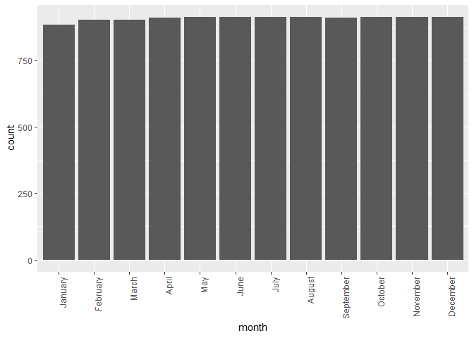
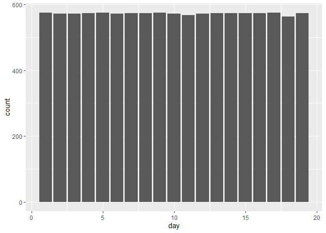
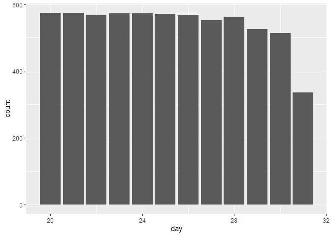
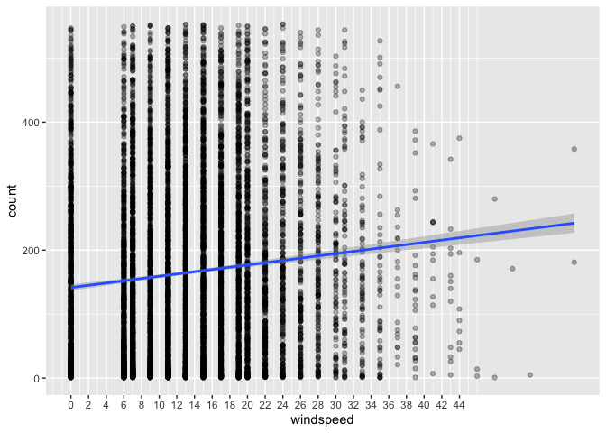
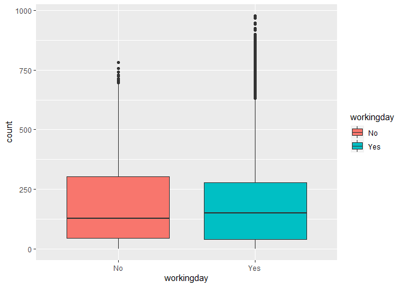
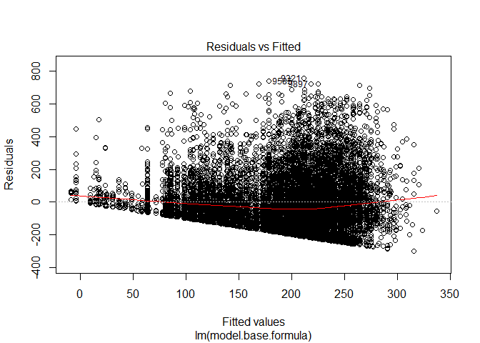
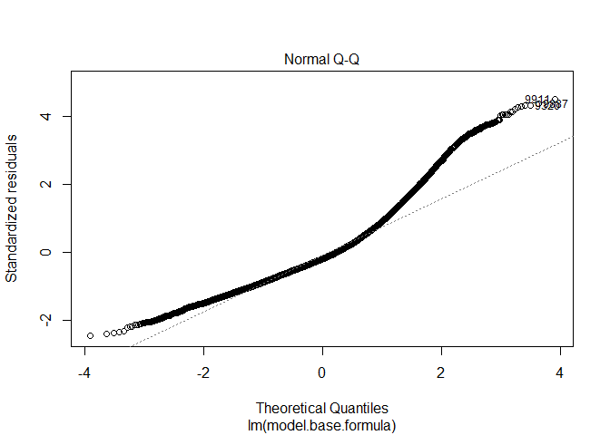
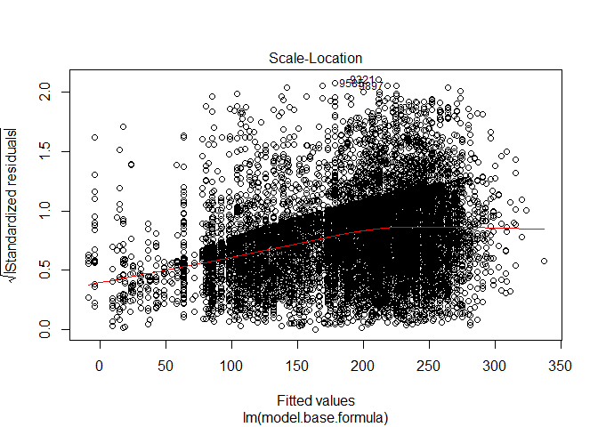
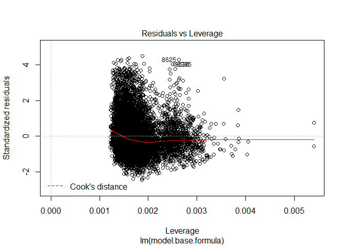

Exploratory\_Data\_Analysis
================
Chance Robinson
9/21/2019

  - [Exploratory Data Analysis](#exploratory-data-analysis)
      - [Library Imports](#library-imports)
      - [Load the csv data](#load-the-csv-data)
      - [Column Names (Train)](#column-names-train)
      - [Example Output (Train)](#example-output-train)
      - [Example Output (Train)](#example-output-train-1)
      - [Example output (Test)](#example-output-test)
      - [Identify Dimensions](#identify-dimensions)
      - [Missing Data (Both)](#missing-data-both)
      - [Data Dictionary](#data-dictionary)
      - [Factors](#factors)
      - [Split Date-Time (Both)](#split-date-time-both)
      - [Convert Months to Ordered Factor
        (Both)](#convert-months-to-ordered-factor-both)
      - [Count by Month (Train)](#count-by-month-train)
      - [Count by Month (Test)](#count-by-month-test)
      - [Days (Train)](#days-train)
      - [Days (Test)](#days-test)
      - [Explanatory Variable plots against Response
        Variable](#explanatory-variable-plots-against-response-variable)
      - [Model Fitting](#model-fitting)

## Exploratory Data Analysis

### Library Imports

``` r
library(tidyverse)
```

    ## -- Attaching packages ---------------------------------------------------------------------------------------------------------------- tidyverse 1.2.1 --

    ## v ggplot2 3.2.0     v purrr   0.3.2
    ## v tibble  2.1.3     v dplyr   0.8.3
    ## v tidyr   0.8.3     v stringr 1.4.0
    ## v readr   1.3.1     v forcats 0.4.0

    ## -- Conflicts ------------------------------------------------------------------------------------------------------------------- tidyverse_conflicts() --
    ## x dplyr::filter() masks stats::filter()
    ## x dplyr::lag()    masks stats::lag()

``` r
library(lubridate)
```

    ## 
    ## Attaching package: 'lubridate'

    ## The following object is masked from 'package:base':
    ## 
    ##     date

### Load the csv data

``` r
train <- read_csv('../../data/train.csv')
test <- read_csv('../../data/test.csv')
```

### Column Names (Train)

``` r
colnames(train)
```

    ##  [1] "datetime"   "season"     "holiday"    "workingday" "weather"   
    ##  [6] "temp"       "atemp"      "humidity"   "windspeed"  "casual"    
    ## [11] "registered" "count"

### Example Output (Train)

``` r
head(train)
```

    ## # A tibble: 6 x 12
    ##   datetime            season holiday workingday weather  temp atemp
    ##   <dttm>               <dbl>   <dbl>      <dbl>   <dbl> <dbl> <dbl>
    ## 1 2011-01-01 00:00:00      1       0          0       1  9.84  14.4
    ## 2 2011-01-01 01:00:00      1       0          0       1  9.02  13.6
    ## 3 2011-01-01 02:00:00      1       0          0       1  9.02  13.6
    ## 4 2011-01-01 03:00:00      1       0          0       1  9.84  14.4
    ## 5 2011-01-01 04:00:00      1       0          0       1  9.84  14.4
    ## 6 2011-01-01 05:00:00      1       0          0       2  9.84  12.9
    ## # ... with 5 more variables: humidity <dbl>, windspeed <dbl>,
    ## #   casual <dbl>, registered <dbl>, count <dbl>

### Example Output (Train)

``` r
head(train)
```

    ## # A tibble: 6 x 12
    ##   datetime            season holiday workingday weather  temp atemp
    ##   <dttm>               <dbl>   <dbl>      <dbl>   <dbl> <dbl> <dbl>
    ## 1 2011-01-01 00:00:00      1       0          0       1  9.84  14.4
    ## 2 2011-01-01 01:00:00      1       0          0       1  9.02  13.6
    ## 3 2011-01-01 02:00:00      1       0          0       1  9.02  13.6
    ## 4 2011-01-01 03:00:00      1       0          0       1  9.84  14.4
    ## 5 2011-01-01 04:00:00      1       0          0       1  9.84  14.4
    ## 6 2011-01-01 05:00:00      1       0          0       2  9.84  12.9
    ## # ... with 5 more variables: humidity <dbl>, windspeed <dbl>,
    ## #   casual <dbl>, registered <dbl>, count <dbl>

### Example output (Test)

  - The test data set is missing 3 columns from the train data set
    (causal, registered and count)

<!-- end list -->

``` r
head(test)
```

    ## # A tibble: 6 x 9
    ##   datetime            season holiday workingday weather  temp atemp
    ##   <dttm>               <dbl>   <dbl>      <dbl>   <dbl> <dbl> <dbl>
    ## 1 2011-01-20 00:00:00      1       0          1       1 10.7   11.4
    ## 2 2011-01-20 01:00:00      1       0          1       1 10.7   13.6
    ## 3 2011-01-20 02:00:00      1       0          1       1 10.7   13.6
    ## 4 2011-01-20 03:00:00      1       0          1       1 10.7   12.9
    ## 5 2011-01-20 04:00:00      1       0          1       1 10.7   12.9
    ## 6 2011-01-20 05:00:00      1       0          1       1  9.84  11.4
    ## # ... with 2 more variables: humidity <dbl>, windspeed <dbl>

### Identify Dimensions

  - Train {“rows”: 10886, “columns”: 12}

  - Test {“rows”: 6493, “columns”: 9}

### Missing Data (Both)

  - No NA values can be found in either the training or test data sets

<!-- end list -->

``` r
# train
any(is.na(train))
```

    ## [1] FALSE

``` r
# test
any(is.na(test))
```

    ## [1] FALSE

### Data Dictionary

| Column Name     | Type Description |                                                |
| --------------- | ---------------- | ---------------------------------------------- |
| 1\. datetime    | Date             | YYYY-MM-DD HH24 (example: 2011-01-01 04:00:00) |
| 2\. season      | Integer          | (1-4)                                          |
| 3\. holiday     | Integer          | (0 or 1)                                       |
| 4\. workingday  | Integer          | (0 or 1)                                       |
| 5\. weather     | Integer          | (1-4)                                          |
| 6\. temp        | Float            | temparture in Celcius                          |
| 7\. atemp       | Float            | “feels like” temperature in Celsius            |
| 8\. humidity    | Integer          | relative humidity                              |
| 9\. windspeed   | Float            | wind speed                                     |
| 10\. casual     | Integer          | count of casual users                          |
| 11\. registered | Integer          | count of registered users                      |
| 12\. count      | Integer          | count of total users `response variable`       |

### Factors

  - season
      - 1 = Dec 21 \~ March 20 (Spring)
      - 2 = March 21 \~ Jun 20 (Summer)
      - 3 = June 21 \~ Sept 20 (Fall)
      - 4 = Sept 21 \~ Dec 20 (Winter)
  - holiday
      - 0 = No
      - 1 = Yes
  - workingday
      - 0 = No
      - 1 =
Yes

<!-- end list -->

``` r
train$season <- factor(train$season, labels = c("Spring", "Summer", "Fall", "Winter"))
test$season <- factor(test$season, labels = c("Spring", "Summer", "Fall", "Winter"))

table(train$season)
```

    ## 
    ## Spring Summer   Fall Winter 
    ##   2686   2733   2733   2734

``` r
train$holiday <- factor(train$holiday, labels = c("No", "Yes"))
test$holiday <- factor(test$holiday, labels = c("No", "Yes"))

table(test$holiday)
```

    ## 
    ##   No  Yes 
    ## 6304  189

``` r
train$workingday <- factor(train$workingday, labels = c("No", "Yes"))
test$workingday <- factor(test$workingday, labels = c("No", "Yes"))


train$weather <- factor(train$weather, labels = c("Great", "Good", "Average", "Poor"))
test$weather <- factor(test$weather, labels = c("Great", "Good", "Average", "Poor"))


table(test$weather)
```

    ## 
    ##   Great    Good Average    Poor 
    ##    4221    1710     560       2

### Split Date-Time (Both)

  - Year, Month, Day and Hour

<!-- end list -->

``` r
library(lubridate)


train <- train %>%
  mutate(year = as.numeric(format(datetime, format = "%Y")), 
         month = as.numeric(format(datetime, format = "%m")), 
         day = as.numeric(format(datetime, format = "%d")),
         hour = as.numeric(format(datetime, format = "%H")))

test <- test %>%
  mutate(year = as.numeric(format(datetime, format = "%Y")), 
         month = as.numeric(format(datetime, format = "%m")), 
         day = as.numeric(format(datetime, format = "%d")),
         hour = as.numeric(format(datetime, format = "%H")))
```

### Convert Months to Ordered Factor (Both)

``` r
train$month <-month(train$datetime, label = TRUE, abbr = FALSE)
test$month <-month(test$datetime, label = TRUE, abbr = FALSE)
```

### Count by Month (Train)

  - The months seem to show an upward trend throughout the year
  - Increased popularity of Ride-Sharing program?

<!-- end list -->

``` r
train %>%
  ggplot(aes(x = month)) + 
  geom_bar() +
  theme(axis.text.x = element_text(angle = 90, hjust = 1))
```

<!-- -->

### Count by Month (Test)

  - Notice how the months with fewer days have fewer totals
    (i.e…February)

<!-- end list -->

``` r
test %>%
  ggplot(aes(x = month)) + 
  geom_bar() +
  theme(axis.text.x = element_text(angle = 90, hjust = 1))
```

<!-- -->

### Days (Train)

  - The train data set covers days from the 1st through the 19th

<!-- end list -->

``` r
train %>%
  ggplot(aes(x = day)) + 
  geom_bar()
```

<!-- -->

### Days (Test)

  - The test set covers days from the 20th through the 31st

<!-- end list -->

``` r
test %>%
  ggplot(aes(x = day)) + 
  geom_bar()
```

<!-- -->

``` r
head(train)
```

    ## # A tibble: 6 x 16
    ##   datetime            season holiday workingday weather  temp atemp
    ##   <dttm>              <fct>  <fct>   <fct>      <fct>   <dbl> <dbl>
    ## 1 2011-01-01 00:00:00 Spring No      No         Great    9.84  14.4
    ## 2 2011-01-01 01:00:00 Spring No      No         Great    9.02  13.6
    ## 3 2011-01-01 02:00:00 Spring No      No         Great    9.02  13.6
    ## 4 2011-01-01 03:00:00 Spring No      No         Great    9.84  14.4
    ## 5 2011-01-01 04:00:00 Spring No      No         Great    9.84  14.4
    ## 6 2011-01-01 05:00:00 Spring No      No         Good     9.84  12.9
    ## # ... with 9 more variables: humidity <dbl>, windspeed <dbl>,
    ## #   casual <dbl>, registered <dbl>, count <dbl>, year <dbl>, month <ord>,
    ## #   day <dbl>, hour <dbl>

### Explanatory Variable plots against Response Variable

``` r
train %>%
  ggplot(aes(x=season, y=count, fill=season)) + geom_boxplot()
```

<!-- -->

``` r
train %>%
  ggplot(aes(x=holiday, y=count, fill=holiday)) + geom_boxplot()
```

<!-- -->

``` r
train %>%
  ggplot(aes(x=workingday, y=count, fill=workingday)) + geom_boxplot()
```

<!-- -->

``` r
train %>%
  ggplot(aes(x=weather, y=count, fill=weather)) + geom_boxplot()
```

<!-- -->

### Model Fitting

``` r
model.base.formula = count ~ season + 
                             holiday +
                             workingday + 
                             weather + 
                             windspeed


model  <- lm(formula = model.base.formula, data = train)

plot(model)
```

<!-- --><!-- --><!-- -->

    ## Warning in sqrt(crit * p * (1 - hh)/hh): NaNs produced
    
    ## Warning in sqrt(crit * p * (1 - hh)/hh): NaNs produced

<!-- -->
