Exploratory\_Data\_Analysis
================
Chance Robinson
9/21/2019

## Exploratory Data Analysis

### Library Imports

``` r
library(tidyverse)
```

    ## ── Attaching packages ──────────────────────────────────────────────────────────────────────────────────────────── tidyverse 1.2.1 ──

    ## ✔ ggplot2 3.2.0     ✔ purrr   0.3.2
    ## ✔ tibble  2.1.3     ✔ dplyr   0.8.3
    ## ✔ tidyr   0.8.3     ✔ stringr 1.4.0
    ## ✔ readr   1.3.1     ✔ forcats 0.4.0

    ## ── Conflicts ─────────────────────────────────────────────────────────────────────────────────────────────── tidyverse_conflicts() ──
    ## ✖ dplyr::filter() masks stats::filter()
    ## ✖ dplyr::lag()    masks stats::lag()

``` r
# Date manipulation
library(lubridate)
```

    ## 
    ## Attaching package: 'lubridate'

    ## The following object is masked from 'package:base':
    ## 
    ##     date

``` r
# Plotting
library(olsrr)
```

    ## 
    ## Attaching package: 'olsrr'

    ## The following object is masked from 'package:datasets':
    ## 
    ##     rivers

``` r
# RMLSE
library(MLmetrics)
```

    ## 
    ## Attaching package: 'MLmetrics'

    ## The following object is masked from 'package:base':
    ## 
    ##     Recall

### Load the csv data

``` r
train <- read_csv('../../data/train.csv')
test <- read_csv('../../data/test.csv')
```

### Column Names (Train)

``` r
colnames(train)
```

    ##  [1] "datetime"   "season"     "holiday"    "workingday" "weather"   
    ##  [6] "temp"       "atemp"      "humidity"   "windspeed"  "casual"    
    ## [11] "registered" "count"

### Example Output (Train)

``` r
head(train)
```

    ## # A tibble: 6 x 12
    ##   datetime            season holiday workingday weather  temp atemp
    ##   <dttm>               <dbl>   <dbl>      <dbl>   <dbl> <dbl> <dbl>
    ## 1 2011-01-01 00:00:00      1       0          0       1  9.84  14.4
    ## 2 2011-01-01 01:00:00      1       0          0       1  9.02  13.6
    ## 3 2011-01-01 02:00:00      1       0          0       1  9.02  13.6
    ## 4 2011-01-01 03:00:00      1       0          0       1  9.84  14.4
    ## 5 2011-01-01 04:00:00      1       0          0       1  9.84  14.4
    ## 6 2011-01-01 05:00:00      1       0          0       2  9.84  12.9
    ## # … with 5 more variables: humidity <dbl>, windspeed <dbl>, casual <dbl>,
    ## #   registered <dbl>, count <dbl>

### Example output (Test)

  - The test data set is missing 3 columns from the train data set
    (causal, registered and count)

<!-- end list -->

``` r
head(test)
```

    ## # A tibble: 6 x 9
    ##   datetime            season holiday workingday weather  temp atemp
    ##   <dttm>               <dbl>   <dbl>      <dbl>   <dbl> <dbl> <dbl>
    ## 1 2011-01-20 00:00:00      1       0          1       1 10.7   11.4
    ## 2 2011-01-20 01:00:00      1       0          1       1 10.7   13.6
    ## 3 2011-01-20 02:00:00      1       0          1       1 10.7   13.6
    ## 4 2011-01-20 03:00:00      1       0          1       1 10.7   12.9
    ## 5 2011-01-20 04:00:00      1       0          1       1 10.7   12.9
    ## 6 2011-01-20 05:00:00      1       0          1       1  9.84  11.4
    ## # … with 2 more variables: humidity <dbl>, windspeed <dbl>

### Identify Dimensions

  - Train {“rows”: 10886, “columns”: 12}

  - Test {“rows”: 6493, “columns”: 9}

### Missing Data (Both)

  - No NA values can be found in either the training or test data sets

<!-- end list -->

``` r
# train
any(is.na(train))
```

    ## [1] FALSE

``` r
# test
any(is.na(test))
```

    ## [1] FALSE

### Data Dictionary

| Column Name     | Type Description |                                                |
| --------------- | ---------------- | ---------------------------------------------- |
| 1\. datetime    | Date             | YYYY-MM-DD HH24 (example: 2011-01-01 04:00:00) |
| 2\. season      | Integer          | (1-4)                                          |
| 3\. holiday     | Integer          | (0 or 1)                                       |
| 4\. workingday  | Integer          | (0 or 1)                                       |
| 5\. weather     | Integer          | (1-4)                                          |
| 6\. temp        | Float            | temparture in Celcius                          |
| 7\. atemp       | Float            | “feels like” temperature in Celsius            |
| 8\. humidity    | Integer          | relative humidity                              |
| 9\. windspeed   | Float            | wind speed                                     |
| 10\. casual     | Integer          | count of casual users                          |
| 11\. registered | Integer          | count of registered users                      |
| 12\. count      | Integer          | count of total users `response variable`       |

### Factors

  - season
      - 1 = Dec 21 ~ March 20 (Spring)
      - 2 = March 21 ~ Jun 20 (Summer)
      - 3 = June 21 ~ Sept 20 (Fall)
      - 4 = Sept 21 ~ Dec 20 (Winter)
  - holiday
      - 0 = No
      - 1 = Yes
  - workingday
      - 0 = No
      - 1 =
Yes

<!-- end list -->

``` r
train$season <- factor(train$season, labels = c("Spring", "Summer", "Fall", "Winter"))
test$season <- factor(test$season, labels = c("Spring", "Summer", "Fall", "Winter"))

table(train$season)
```

    ## 
    ## Spring Summer   Fall Winter 
    ##   2686   2733   2733   2734

``` r
train$holiday <- factor(train$holiday, labels = c("No", "Yes"))
test$holiday <- factor(test$holiday, labels = c("No", "Yes"))

table(train$holiday)
```

    ## 
    ##    No   Yes 
    ## 10575   311

``` r
train$workingday <- factor(train$workingday, labels = c("No", "Yes"))
test$workingday <- factor(test$workingday, labels = c("No", "Yes"))

table(train$workingday)
```

    ## 
    ##   No  Yes 
    ## 3474 7412

``` r
train$weather <- factor(train$weather, labels = c("Great", "Good", "Average", "Poor"))
test$weather <- factor(test$weather, labels = c("Great", "Good", "Average", "Poor"))


table(train$weather)
```

    ## 
    ##   Great    Good Average    Poor 
    ##    7192    2834     859       1

### Split Date-Time (Both)

  - Year, Month, Day and Hour

<!-- end list -->

``` r
library(lubridate)

train <- train %>%
  mutate(year = as.factor(format(datetime, format = "%Y")), 
         month = as.numeric(format(datetime, format = "%m")), 
         day = as.factor(format(datetime, format = "%d")),
         hour = as.factor(format(datetime, format = "%H")))

test <- test %>%
  mutate(year = as.factor(format(datetime, format = "%Y")), 
         month = as.numeric(format(datetime, format = "%m")), 
         day = as.factor(format(datetime, format = "%d")),
         hour = as.factor(format(datetime, format = "%H")))
```

### Convert Months to Ordered Factor (Both)

``` r
train$month <-month(train$datetime, label = TRUE, abbr = FALSE)
test$month <-month(test$datetime, label = TRUE, abbr = FALSE)
```

### Count by Month (Train)

  - The months seem to show an upward trend throughout the year
  - Increased popularity of Ride-Sharing program?

<!-- end list -->

``` r
train %>%
  ggplot(aes(x = month)) + 
  geom_bar() +
  theme(axis.text.x = element_text(angle = 90, hjust = 1))
```

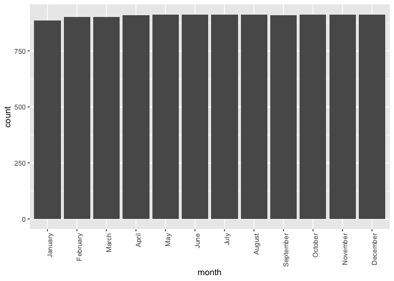<!-- -->

### Count by Month (Test)

  - Notice how the months with fewer days have fewer totals
    (i.e…February)

<!-- end list -->

``` r
test %>%
  ggplot(aes(x = month)) + 
  geom_bar() +
  theme(axis.text.x = element_text(angle = 90, hjust = 1))
```

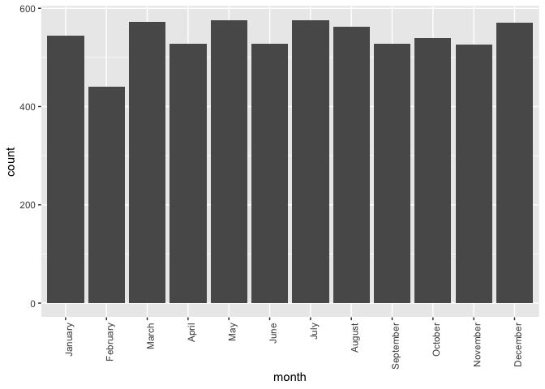<!-- -->

### Days (Train)

  - The train data set covers days from the 1st through the 19th

<!-- end list -->

``` r
train %>%
  ggplot(aes(x = day)) + 
  geom_bar()
```

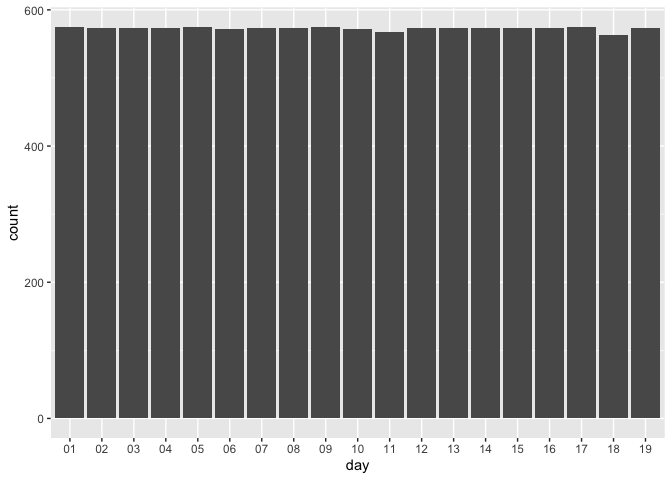<!-- -->

### Days (Test)

  - The test set covers days from the 20th through the 31st

<!-- end list -->

``` r
test %>%
  ggplot(aes(x = day)) + 
  geom_bar()
```

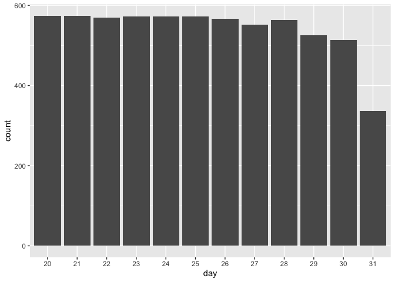<!-- -->

### Outlier

``` r
outliers <- train[   train$count > mean(train$count) + (sd(train$count) * 2), ]

outliers
```

    ## # A tibble: 589 x 16
    ##    datetime            season holiday workingday weather  temp atemp
    ##    <dttm>              <fct>  <fct>   <fct>      <fct>   <dbl> <dbl>
    ##  1 2011-05-09 17:00:00 Summer No      Yes        Great    25.4  31.1
    ##  2 2011-05-10 17:00:00 Summer No      Yes        Great    26.2  31.1
    ##  3 2011-05-12 17:00:00 Summer No      Yes        Good     26.2  31.1
    ##  4 2011-05-17 17:00:00 Summer No      Yes        Great    25.4  30.3
    ##  5 2011-05-18 17:00:00 Summer No      Yes        Great    24.6  29.5
    ##  6 2011-06-02 17:00:00 Summer No      Yes        Great    31.2  32.6
    ##  7 2011-06-03 17:00:00 Summer No      Yes        Great    29.5  31.8
    ##  8 2011-06-03 18:00:00 Summer No      Yes        Great    28.7  31.8
    ##  9 2011-06-06 17:00:00 Summer No      Yes        Great    32.0  34.1
    ## 10 2011-06-06 18:00:00 Summer No      Yes        Great    31.2  33.3
    ## # … with 579 more rows, and 9 more variables: humidity <dbl>,
    ## #   windspeed <dbl>, casual <dbl>, registered <dbl>, count <dbl>,
    ## #   year <fct>, month <ord>, day <fct>, hour <fct>

``` r
train <- train %>%
  filter(!datetime %in% outliers$datetime)


## maybe remove observations where the count is more than 2-3 SDs from the mean of the month instead?

train %>%
  group_by(month) %>%
  summarize(mean = mean(count), sd = sd(count), median = median(count), count = n()) %>%
  arrange(desc(month)) 
```

    ## # A tibble: 12 x 5
    ##    month      mean    sd median count
    ##    <ord>     <dbl> <dbl>  <dbl> <int>
    ##  1 December  160.  133.   134     883
    ##  2 November  174.  140.   152     872
    ##  3 October   187.  150.   166     841
    ##  4 September 186.  148.   165     825
    ##  5 August    196.  149.   180.    842
    ##  6 July      207.  150.   191     857
    ##  7 June      200.  152.   182     829
    ##  8 May       186.  148.   170.    848
    ##  9 April     150.  135.   115     847
    ## 10 March     129.  123.    95.5   868
    ## 11 February  110.  110.    78     901
    ## 12 January    90.4  95.3   65     884

``` r
train[5632,]
```

    ## # A tibble: 1 x 16
    ##   datetime            season holiday workingday weather  temp atemp
    ##   <dttm>              <fct>  <fct>   <fct>      <fct>   <dbl> <dbl>
    ## 1 2012-01-11 23:00:00 Spring No      Yes        Average  13.9  15.9
    ## # … with 9 more variables: humidity <dbl>, windspeed <dbl>, casual <dbl>,
    ## #   registered <dbl>, count <dbl>, year <fct>, month <ord>, day <fct>,
    ## #   hour <fct>

``` r
train <- train %>%
  filter(!datetime=='2012-01-09 18:00:00')

train
```

    ## # A tibble: 10,296 x 16
    ##    datetime            season holiday workingday weather  temp atemp
    ##    <dttm>              <fct>  <fct>   <fct>      <fct>   <dbl> <dbl>
    ##  1 2011-01-01 00:00:00 Spring No      No         Great    9.84  14.4
    ##  2 2011-01-01 01:00:00 Spring No      No         Great    9.02  13.6
    ##  3 2011-01-01 02:00:00 Spring No      No         Great    9.02  13.6
    ##  4 2011-01-01 03:00:00 Spring No      No         Great    9.84  14.4
    ##  5 2011-01-01 04:00:00 Spring No      No         Great    9.84  14.4
    ##  6 2011-01-01 05:00:00 Spring No      No         Good     9.84  12.9
    ##  7 2011-01-01 06:00:00 Spring No      No         Great    9.02  13.6
    ##  8 2011-01-01 07:00:00 Spring No      No         Great    8.2   12.9
    ##  9 2011-01-01 08:00:00 Spring No      No         Great    9.84  14.4
    ## 10 2011-01-01 09:00:00 Spring No      No         Great   13.1   17.4
    ## # … with 10,286 more rows, and 9 more variables: humidity <dbl>,
    ## #   windspeed <dbl>, casual <dbl>, registered <dbl>, count <dbl>,
    ## #   year <fct>, month <ord>, day <fct>, hour <fct>

### Explanatory Variable plots against Response Variable

#### Continuous Variables

``` r
train %>%
  ggplot(aes(x = temp, y = count)) + 
  geom_point(alpha = 0.3) + 
  scale_x_continuous(breaks = seq(from = 0, to = 45, by = 2)) + 
  geom_smooth(method = 'lm')
```

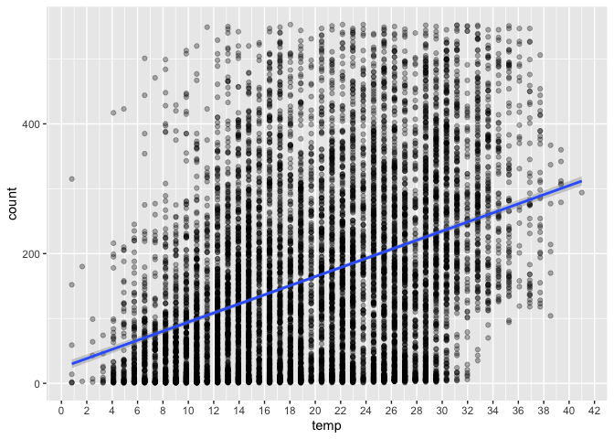<!-- -->

``` r
train %>%
  ggplot(aes(x = windspeed, y = count)) + 
  geom_point(alpha = 0.3) + 
  scale_x_continuous(breaks = seq(from = 0, to = 45, by = 2)) + 
  geom_smooth(method = 'lm')
```

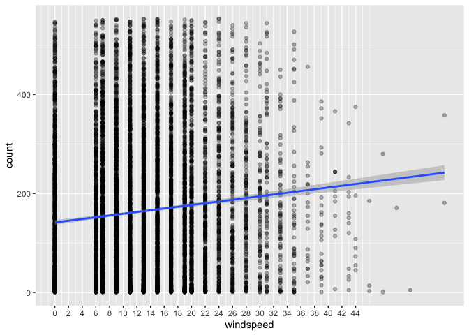<!-- -->

#### Categorical Variables

``` r
train %>%
  ggplot(aes(x=season, y=count, fill=season)) + geom_boxplot()
```

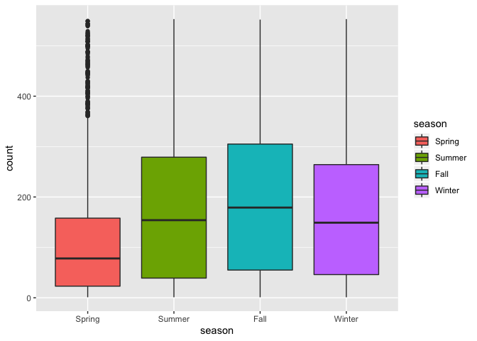<!-- -->

``` r
train %>%
  ggplot(aes(x=holiday, y=count, fill=holiday)) + geom_boxplot()
```

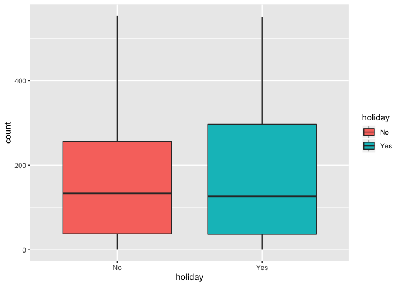<!-- -->

``` r
train %>%
  ggplot(aes(x=workingday, y=count, fill=workingday)) + geom_boxplot()
```

<!-- -->

``` r
train %>%
  ggplot(aes(x=weather, y=count, fill=weather)) + geom_boxplot()
```

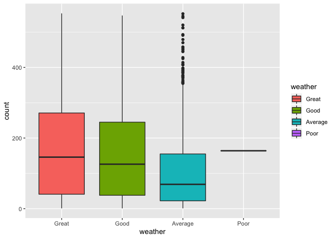<!-- -->

``` r
train %>%
  ggplot(aes(x=month, y=count, fill=month)) + geom_boxplot() + 
  theme(axis.text.x = element_text(angle = 90, hjust = 1))
```

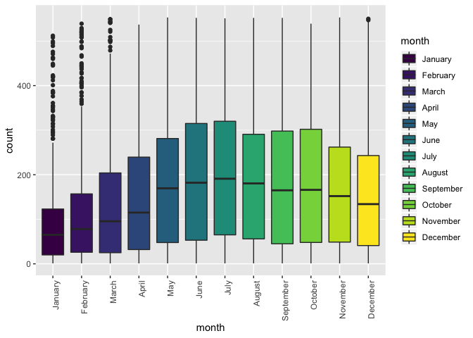<!-- -->

### Model Fitting

``` r
model.base.formula = count ~ weather + 
                             windspeed + 
                             temp + 
                             month +
                             hour +
                             month:hour
  
  # datetime


model  <- lm(formula = model.base.formula, data = train)

plot(model)
```

    ## Warning: not plotting observations with leverage one:
    ##   5580

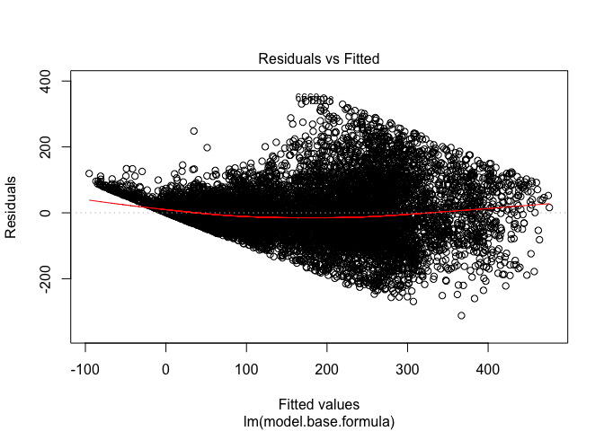<!-- -->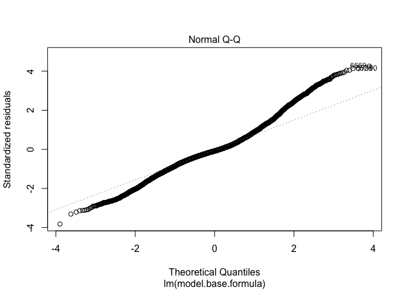<!-- -->

    ## Warning: not plotting observations with leverage one:
    ##   5580

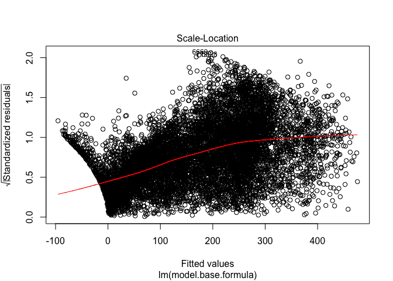<!-- -->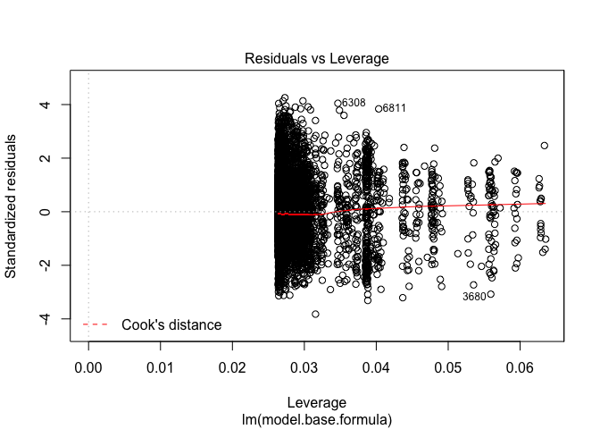<!-- -->

``` r
summary(model)
```

    ## 
    ## Call:
    ## lm(formula = model.base.formula, data = train)
    ## 
    ## Residuals:
    ##     Min      1Q  Median      3Q     Max 
    ## -311.89  -44.49   -6.92   39.80  347.99 
    ## 
    ## Coefficients:
    ##                   Estimate Std. Error t value Pr(>|t|)    
    ## (Intercept)      -35.03517    6.24837  -5.607 2.11e-08 ***
    ## weatherGood      -14.55053    1.92094  -7.575 3.92e-14 ***
    ## weatherAverage   -78.85165    3.08273 -25.578  < 2e-16 ***
    ## weatherPoor      -23.42918   84.03247  -0.279 0.780396    
    ## windspeed         -0.34064    0.10717  -3.178 0.001485 ** 
    ## temp               5.39858    0.25119  21.492  < 2e-16 ***
    ## month.L            1.69655   13.60422   0.125 0.900758    
    ## month.Q           60.95715   14.37780   4.240 2.26e-05 ***
    ## month.C           13.99623   13.53656   1.034 0.301181    
    ## month^4          -19.52674   13.55012  -1.441 0.149595    
    ## month^5          -13.70737   13.48904  -1.016 0.309565    
    ## month^6           -4.71571   13.45630  -0.350 0.726011    
    ## month^7           12.41413   13.45550   0.923 0.356234    
    ## month^8           -0.87103   13.45322  -0.065 0.948378    
    ## month^9           -4.16160   13.45063  -0.309 0.757025    
    ## month^10           1.63527   13.45100   0.122 0.903240    
    ## month^11          -9.77681   13.45409  -0.727 0.467439    
    ## hour01           -17.70908    5.50119  -3.219 0.001290 ** 
    ## hour02           -28.43178    5.52569  -5.145 2.72e-07 ***
    ## hour03           -38.15137    5.58617  -6.830 9.01e-12 ***
    ## hour04           -40.85692    5.54893  -7.363 1.94e-13 ***
    ## hour05           -26.74622    5.51875  -4.846 1.28e-06 ***
    ## hour06            31.64851    5.51095   5.743 9.58e-09 ***
    ## hour07           164.38711    5.51922  29.784  < 2e-16 ***
    ## hour08           210.14744    5.99127  35.076  < 2e-16 ***
    ## hour09           167.01497    5.50424  30.343  < 2e-16 ***
    ## hour10           115.11852    5.51580  20.871  < 2e-16 ***
    ## hour11           136.53707    5.57093  24.509  < 2e-16 ***
    ## hour12           170.73854    5.62689  30.343  < 2e-16 ***
    ## hour13           163.09128    5.67214  28.753  < 2e-16 ***
    ## hour14           148.69159    5.69331  26.117  < 2e-16 ***
    ## hour15           160.39778    5.70409  28.120  < 2e-16 ***
    ## hour16           227.07624    5.70060  39.834  < 2e-16 ***
    ## hour17           285.21222    6.47943  44.018  < 2e-16 ***
    ## hour18           273.71978    6.15992  44.436  < 2e-16 ***
    ## hour19           228.84894    5.67269  40.342  < 2e-16 ***
    ## hour20           165.43641    5.51878  29.977  < 2e-16 ***
    ## hour21           111.68933    5.50741  20.280  < 2e-16 ***
    ## hour22            74.99346    5.49904  13.638  < 2e-16 ***
    ## hour23            34.61083    5.49599   6.297 3.15e-10 ***
    ## month.L:hour01   -18.23200   19.08104  -0.956 0.339346    
    ## month.Q:hour01    23.73221   19.08965   1.243 0.213824    
    ## month.C:hour01     8.18012   19.09037   0.428 0.668300    
    ## month^4:hour01    -9.72722   19.05917  -0.510 0.609804    
    ## month^5:hour01    -5.01928   19.04630  -0.264 0.792147    
    ## month^6:hour01     2.11410   19.04570   0.111 0.911617    
    ## month^7:hour01    -7.65380   19.02537  -0.402 0.687476    
    ## month^8:hour01    -1.83268   19.02953  -0.096 0.923278    
    ## month^9:hour01    -5.24850   19.04980  -0.276 0.782926    
    ## month^10:hour01    0.65234   19.04200   0.034 0.972672    
    ## month^11:hour01    6.61054   19.02546   0.347 0.728255    
    ## month.L:hour02   -31.41340   19.20672  -1.636 0.101967    
    ## month.Q:hour02    30.44855   19.16567   1.589 0.112159    
    ## month.C:hour02     9.58533   19.19706   0.499 0.617570    
    ## month^4:hour02    -6.02240   19.18337  -0.314 0.753574    
    ## month^5:hour02    -1.13319   19.10746  -0.059 0.952710    
    ## month^6:hour02     8.59350   19.09554   0.450 0.652701    
    ## month^7:hour02    -8.21206   19.14020  -0.429 0.667898    
    ## month^8:hour02    -8.64382   19.15845  -0.451 0.651873    
    ## month^9:hour02    -1.31878   19.12196  -0.069 0.945017    
    ## month^10:hour02   -2.04833   19.06314  -0.107 0.914434    
    ## month^11:hour02    5.52752   19.02966   0.290 0.771464    
    ## month.L:hour03   -35.57588   19.65097  -1.810 0.070266 .  
    ## month.Q:hour03    37.68047   19.64175   1.918 0.055090 .  
    ## month.C:hour03    10.08625   19.58659   0.515 0.606594    
    ## month^4:hour03    -9.24407   19.45678  -0.475 0.634720    
    ## month^5:hour03    -4.18780   19.35135  -0.216 0.828674    
    ## month^6:hour03     8.70008   19.29524   0.451 0.652077    
    ## month^7:hour03    -2.99658   19.20852  -0.156 0.876034    
    ## month^8:hour03    -8.48549   19.17562  -0.443 0.658126    
    ## month^9:hour03     1.38466   19.17026   0.072 0.942421    
    ## month^10:hour03   -2.93169   19.10351  -0.153 0.878036    
    ## month^11:hour03    8.54926   19.04201   0.449 0.653464    
    ## month.L:hour04   -41.05283   19.32209  -2.125 0.033640 *  
    ## month.Q:hour04    41.18091   19.23480   2.141 0.032301 *  
    ## month.C:hour04    13.81951   19.23084   0.719 0.472397    
    ## month^4:hour04    -6.89572   19.26039  -0.358 0.720332    
    ## month^5:hour04    -8.85855   19.23738  -0.460 0.645177    
    ## month^6:hour04     4.99355   19.22678   0.260 0.795086    
    ## month^7:hour04    -0.58966   19.22444  -0.031 0.975532    
    ## month^8:hour04    -5.88089   19.19265  -0.306 0.759296    
    ## month^9:hour04     3.35756   19.13147   0.175 0.860691    
    ## month^10:hour04    1.95930   19.06515   0.103 0.918149    
    ## month^11:hour04    9.18690   19.03365   0.483 0.629343    
    ## month.L:hour05   -30.04397   19.13548  -1.570 0.116431    
    ## month.Q:hour05    35.43485   19.12751   1.853 0.063975 .  
    ## month.C:hour05    12.71634   19.11749   0.665 0.505958    
    ## month^4:hour05    -8.92281   19.10364  -0.467 0.640457    
    ## month^5:hour05    -8.07941   19.07952  -0.423 0.671969    
    ## month^6:hour05     3.39761   19.06368   0.178 0.858550    
    ## month^7:hour05    -1.20217   19.06540  -0.063 0.949724    
    ## month^8:hour05    -6.09454   19.05915  -0.320 0.749150    
    ## month^9:hour05     0.73890   19.03911   0.039 0.969043    
    ## month^10:hour05   -2.91517   19.02663  -0.153 0.878232    
    ## month^11:hour05   12.09075   19.02337   0.636 0.525069    
    ## month.L:hour06     6.14046   19.07659   0.322 0.747547    
    ## month.Q:hour06    -6.45998   19.08616  -0.338 0.735021    
    ## month.C:hour06     4.50342   19.07582   0.236 0.813375    
    ## month^4:hour06    -2.26668   19.05632  -0.119 0.905320    
    ## month^5:hour06   -12.77893   19.03996  -0.671 0.502132    
    ## month^6:hour06     2.63671   19.02816   0.139 0.889794    
    ## month^7:hour06     7.65059   19.02899   0.402 0.687656    
    ## month^8:hour06    -1.58211   19.02182  -0.083 0.933715    
    ## month^9:hour06     2.96449   19.02113   0.156 0.876153    
    ## month^10:hour06    5.49028   19.02357   0.289 0.772890    
    ## month^11:hour06   16.27203   19.02244   0.855 0.392344    
    ## month.L:hour07    91.92987   19.09708   4.814 1.50e-06 ***
    ## month.Q:hour07   -78.66223   19.10981  -4.116 3.88e-05 ***
    ## month.C:hour07    12.59501   19.12732   0.658 0.510243    
    ## month^4:hour07     5.52374   19.07735   0.290 0.772171    
    ## month^5:hour07   -20.73082   19.06448  -1.087 0.276884    
    ## month^6:hour07   -13.43414   19.09618  -0.703 0.481761    
    ## month^7:hour07     8.59169   19.04292   0.451 0.651873    
    ## month^8:hour07     6.10100   19.05695   0.320 0.748865    
    ## month^9:hour07    12.71118   19.12596   0.665 0.506319    
    ## month^10:hour07   16.43926   19.09752   0.861 0.389366    
    ## month^11:hour07   29.33128   19.07729   1.537 0.124203    
    ## month.L:hour08    11.76196   20.36797   0.577 0.563633    
    ## month.Q:hour08     1.32699   20.55786   0.065 0.948534    
    ## month.C:hour08    15.64709   20.70496   0.756 0.449837    
    ## month^4:hour08     3.98234   20.57583   0.194 0.846536    
    ## month^5:hour08    -2.65983   20.51951  -0.130 0.896866    
    ## month^6:hour08   -63.99967   20.59400  -3.108 0.001891 ** 
    ## month^7:hour08    26.26538   20.67673   1.270 0.204012    
    ## month^8:hour08   -10.70022   20.84873  -0.513 0.607801    
    ## month^9:hour08    -9.27395   21.04239  -0.441 0.659420    
    ## month^10:hour08   23.38019   21.11586   1.107 0.268220    
    ## month^11:hour08   24.22494   21.11033   1.148 0.251186    
    ## month.L:hour09    61.45281   19.08346   3.220 0.001285 ** 
    ## month.Q:hour09   -40.78359   19.09698  -2.136 0.032736 *  
    ## month.C:hour09    26.13953   19.07598   1.370 0.170629    
    ## month^4:hour09   -19.68919   19.05752  -1.033 0.301561    
    ## month^5:hour09   -19.42672   19.04079  -1.020 0.307626    
    ## month^6:hour09     5.31147   19.02774   0.279 0.780141    
    ## month^7:hour09     8.56652   19.02291   0.450 0.652485    
    ## month^8:hour09     0.34142   19.02124   0.018 0.985679    
    ## month^9:hour09     9.01504   19.02213   0.474 0.635565    
    ## month^10:hour09    1.73235   19.02046   0.091 0.927432    
    ## month^11:hour09   20.53612   19.02297   1.080 0.280372    
    ## month.L:hour10    63.44670   19.08279   3.325 0.000888 ***
    ## month.Q:hour10   -58.17084   19.09840  -3.046 0.002326 ** 
    ## month.C:hour10    -2.20061   19.07568  -0.115 0.908160    
    ## month^4:hour10   -13.31418   19.05680  -0.699 0.484782    
    ## month^5:hour10   -23.36826   19.04199  -1.227 0.219778    
    ## month^6:hour10    16.05852   19.02973   0.844 0.398765    
    ## month^7:hour10     7.25075   19.02400   0.381 0.703110    
    ## month^8:hour10    -6.15377   19.02188  -0.324 0.746316    
    ## month^9:hour10    -3.72910   19.02120  -0.196 0.844575    
    ## month^10:hour10  -14.87386   19.02126  -0.782 0.434257    
    ## month^11:hour10   13.78525   19.02117   0.725 0.468633    
    ## month.L:hour11    82.46979   19.13817   4.309 1.65e-05 ***
    ## month.Q:hour11   -64.22347   19.15988  -3.352 0.000805 ***
    ## month.C:hour11     9.17750   19.20181   0.478 0.632697    
    ## month^4:hour11    -0.82885   19.13590  -0.043 0.965452    
    ## month^5:hour11   -26.88348   19.12334  -1.406 0.159816    
    ## month^6:hour11    12.19350   19.15768   0.636 0.524477    
    ## month^7:hour11     5.24517   19.12336   0.274 0.783874    
    ## month^8:hour11     2.46433   19.16381   0.129 0.897682    
    ## month^9:hour11    10.43263   19.24261   0.542 0.587719    
    ## month^10:hour11   -9.39743   19.22273  -0.489 0.624944    
    ## month^11:hour11   17.92701   19.17024   0.935 0.349735    
    ## month.L:hour12   104.69383   19.18797   5.456 4.98e-08 ***
    ## month.Q:hour12   -65.95159   19.19697  -3.436 0.000594 ***
    ## month.C:hour12    13.79234   19.25405   0.716 0.473802    
    ## month^4:hour12     5.87076   19.22019   0.305 0.760032    
    ## month^5:hour12   -15.70299   19.23053  -0.817 0.414196    
    ## month^6:hour12    15.96881   19.28328   0.828 0.407624    
    ## month^7:hour12     4.85076   19.25687   0.252 0.801125    
    ## month^8:hour12     3.81661   19.30515   0.198 0.843285    
    ## month^9:hour12     1.24263   19.38131   0.064 0.948880    
    ## month^10:hour12    5.38921   19.35953   0.278 0.780730    
    ## month^11:hour12    4.14439   19.31188   0.215 0.830081    
    ## month.L:hour13    89.58671   19.19731   4.667 3.10e-06 ***
    ## month.Q:hour13   -52.91042   19.24774  -2.749 0.005990 ** 
    ## month.C:hour13    20.74870   19.29557   1.075 0.282262    
    ## month^4:hour13     0.40004   19.25583   0.021 0.983426    
    ## month^5:hour13   -22.68791   19.28382  -1.177 0.239413    
    ## month^6:hour13    13.95012   19.33236   0.722 0.470561    
    ## month^7:hour13     0.27974   19.30730   0.014 0.988440    
    ## month^8:hour13    -0.62948   19.35949  -0.033 0.974062    
    ## month^9:hour13    -0.37091   19.45407  -0.019 0.984789    
    ## month^10:hour13    5.92455   19.47082   0.304 0.760922    
    ## month^11:hour13   -9.82834   19.44670  -0.505 0.613290    
    ## month.L:hour14    85.43715   19.21146   4.447 8.79e-06 ***
    ## month.Q:hour14   -51.20494   19.23244  -2.662 0.007770 ** 
    ## month.C:hour14    11.95840   19.27546   0.620 0.535012    
    ## month^4:hour14    -5.51135   19.26307  -0.286 0.774800    
    ## month^5:hour14   -23.37310   19.27468  -1.213 0.225299    
    ## month^6:hour14    26.11849   19.36023   1.349 0.177342    
    ## month^7:hour14     6.99617   19.29499   0.363 0.716919    
    ## month^8:hour14    12.66207   19.34149   0.655 0.512703    
    ## month^9:hour14    -5.19116   19.44804  -0.267 0.789533    
    ## month^10:hour14   -3.87529   19.39709  -0.200 0.841651    
    ## month^11:hour14   -4.68394   19.40261  -0.241 0.809244    
    ## month.L:hour15   103.45120   19.20679   5.386 7.36e-08 ***
    ## month.Q:hour15   -52.54522   19.22748  -2.733 0.006291 ** 
    ## month.C:hour15     4.63426   19.30549   0.240 0.810297    
    ## month^4:hour15    -9.54850   19.25784  -0.496 0.620029    
    ## month^5:hour15   -26.53130   19.27703  -1.376 0.168754    
    ## month^6:hour15    22.23921   19.31865   1.151 0.249686    
    ## month^7:hour15    19.83252   19.32096   1.026 0.304692    
    ## month^8:hour15     3.68048   19.37355   0.190 0.849333    
    ## month^9:hour15    -4.24398   19.45481  -0.218 0.827320    
    ## month^10:hour15   -6.22411   19.46158  -0.320 0.749115    
    ## month^11:hour15   -3.30156   19.39778  -0.170 0.864854    
    ## month.L:hour16   144.56006   19.22936   7.518 6.05e-14 ***
    ## month.Q:hour16  -116.79346   19.21538  -6.078 1.26e-09 ***
    ## month.C:hour16     3.13190   19.30765   0.162 0.871144    
    ## month^4:hour16     6.51019   19.29936   0.337 0.735878    
    ## month^5:hour16   -30.86889   19.26485  -1.602 0.109112    
    ## month^6:hour16    20.99371   19.30562   1.087 0.276868    
    ## month^7:hour16    22.80916   19.36173   1.178 0.238803    
    ## month^8:hour16     8.12529   19.42683   0.418 0.675773    
    ## month^9:hour16    -5.31614   19.45835  -0.273 0.784701    
    ## month^10:hour16   13.42645   19.41918   0.691 0.489329    
    ## month^11:hour16   24.24262   19.37687   1.251 0.210923    
    ## month.L:hour17   108.14106   20.90401   5.173 2.35e-07 ***
    ## month.Q:hour17  -125.84407   21.45762  -5.865 4.64e-09 ***
    ## month.C:hour17    -7.07048   21.81526  -0.324 0.745864    
    ## month^4:hour17     3.44236   21.69716   0.159 0.873944    
    ## month^5:hour17   -36.23006   21.60219  -1.677 0.093545 .  
    ## month^6:hour17   -34.13528   21.76538  -1.568 0.116836    
    ## month^7:hour17    17.20111   22.20125   0.775 0.438487    
    ## month^8:hour17   -17.21053   22.63962  -0.760 0.447156    
    ## month^9:hour17    17.46922   22.99293   0.760 0.447413    
    ## month^10:hour17   60.14408   23.30005   2.581 0.009857 ** 
    ## month^11:hour17   17.15384   23.47210   0.731 0.464907    
    ## month.L:hour18   108.72385   20.06542   5.418 6.15e-08 ***
    ## month.Q:hour18  -124.99585   20.73608  -6.028 1.72e-09 ***
    ## month.C:hour18    20.94474   20.80040   1.007 0.313988    
    ## month^4:hour18    13.63328   20.73893   0.657 0.510954    
    ## month^5:hour18   -38.61943   20.70589  -1.865 0.062191 .  
    ## month^6:hour18   -11.95078   20.70194  -0.577 0.563765    
    ## month^7:hour18    19.49011   21.10885   0.923 0.355865    
    ## month^8:hour18   -18.83114   21.39618  -0.880 0.378817    
    ## month^9:hour18    -8.54049   21.60446  -0.395 0.692621    
    ## month^10:hour18   44.12675   22.09163   1.997 0.045804 *  
    ## month^11:hour18    8.19238   22.46355   0.365 0.715345    
    ## month.L:hour19    99.37706   19.19383   5.178 2.29e-07 ***
    ## month.Q:hour19  -168.88215   19.40945  -8.701  < 2e-16 ***
    ## month.C:hour19    19.70988   19.44074   1.014 0.310682    
    ## month^4:hour19    41.48454   19.33862   2.145 0.031964 *  
    ## month^5:hour19   -35.48494   19.39831  -1.829 0.067387 .  
    ## month^6:hour19    18.90950   19.43933   0.973 0.330704    
    ## month^7:hour19    20.25551   19.42163   1.043 0.297003    
    ## month^8:hour19    -3.12615   19.50532  -0.160 0.872670    
    ## month^9:hour19     3.42244   19.69302   0.174 0.862034    
    ## month^10:hour19   14.57903   19.84442   0.735 0.462560    
    ## month^11:hour19   -6.78178   19.89644  -0.341 0.733221    
    ## month.L:hour20    87.49845   19.04941   4.593 4.42e-06 ***
    ## month.Q:hour20  -166.82840   19.05606  -8.755  < 2e-16 ***
    ## month.C:hour20   -23.15160   19.05001  -1.215 0.224278    
    ## month^4:hour20    56.22603   19.03856   2.953 0.003152 ** 
    ## month^5:hour20     3.22654   19.03111   0.170 0.865375    
    ## month^6:hour20    -3.31711   19.02452  -0.174 0.861586    
    ## month^7:hour20     8.24879   19.02379   0.434 0.664585    
    ## month^8:hour20    14.67223   19.02116   0.771 0.440510    
    ## month^9:hour20    10.64083   19.02268   0.559 0.575918    
    ## month^10:hour20   -0.41601   19.02224  -0.022 0.982553    
    ## month^11:hour20   14.43129   19.02512   0.759 0.448146    
    ## month.L:hour21    55.67288   19.05219   2.922 0.003484 ** 
    ## month.Q:hour21  -112.91774   19.06707  -5.922 3.28e-09 ***
    ## month.C:hour21   -11.53073   19.05049  -0.605 0.545012    
    ## month^4:hour21    41.06070   19.05165   2.155 0.031168 *  
    ## month^5:hour21     7.69626   19.03380   0.404 0.685966    
    ## month^6:hour21    -7.96829   19.03718  -0.419 0.675543    
    ## month^7:hour21    -2.51271   19.02993  -0.132 0.894956    
    ## month^8:hour21    11.12504   19.03046   0.585 0.558836    
    ## month^9:hour21     1.16262   19.03649   0.061 0.951302    
    ## month^10:hour21   -2.55141   19.02750  -0.134 0.893334    
    ## month^11:hour21    9.55525   19.06204   0.501 0.616191    
    ## month.L:hour22    36.12282   19.04831   1.896 0.057939 .  
    ## month.Q:hour22   -80.29219   19.05376  -4.214 2.53e-05 ***
    ## month.C:hour22   -12.54971   19.05023  -0.659 0.510059    
    ## month^4:hour22    29.10835   19.04024   1.529 0.126350    
    ## month^5:hour22     0.72295   19.03168   0.038 0.969699    
    ## month^6:hour22    -6.93513   19.02529  -0.365 0.715476    
    ## month^7:hour22     7.26913   19.02232   0.382 0.702368    
    ## month^8:hour22     6.34191   19.02127   0.333 0.738831    
    ## month^9:hour22     5.10972   19.02084   0.269 0.788214    
    ## month^10:hour22    0.03271   19.02129   0.002 0.998628    
    ## month^11:hour22    1.61487   19.02222   0.085 0.932348    
    ## month.L:hour23    21.47824   19.04826   1.128 0.259529    
    ## month.Q:hour23   -39.78205   19.05334  -2.088 0.036829 *  
    ## month.C:hour23   -11.35593   19.05015  -0.596 0.551117    
    ## month^4:hour23    18.89556   19.04060   0.992 0.321035    
    ## month^5:hour23    -0.87109   19.03109  -0.046 0.963493    
    ## month^6:hour23    -4.99011   19.02402  -0.262 0.793091    
    ## month^7:hour23     2.23931   19.02185   0.118 0.906289    
    ## month^8:hour23    -3.04516   19.02339  -0.160 0.872825    
    ## month^9:hour23     0.31218   19.02160   0.016 0.986906    
    ## month^10:hour23    3.07466   19.02057   0.162 0.871585    
    ## month^11:hour23    7.43460   19.02159   0.391 0.695916    
    ## ---
    ## Signif. codes:  0 '***' 0.001 '**' 0.01 '*' 0.05 '.' 0.1 ' ' 1
    ## 
    ## Residual standard error: 82.91 on 10003 degrees of freedom
    ## Multiple R-squared:  0.6669, Adjusted R-squared:  0.6572 
    ## F-statistic: 68.59 on 292 and 10003 DF,  p-value: < 2.2e-16

``` r
ols_plot_resid_lev(model)
```

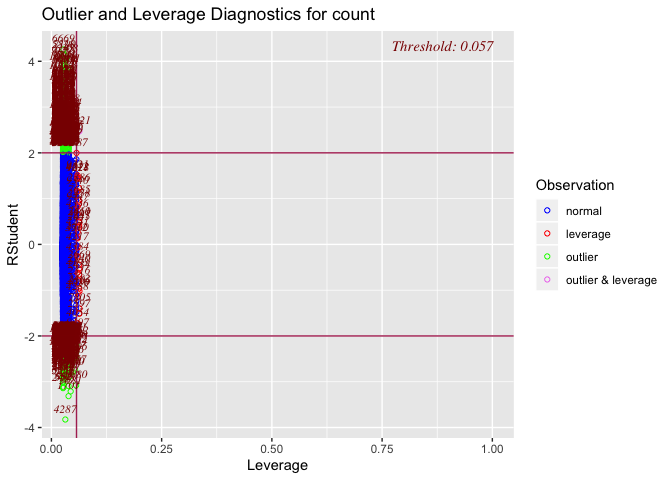<!-- -->

### RMSLE: Root Mean Squared Logarithmic Error Loss

``` r
RMSLE(y_pred = floor(ifelse(model$fitted.values < 0, 0, model$fitted.values)), y_true = train$count)
```

    ## [1] 0.8725848

``` r
## To test in Kaggle, submit the produced "submit" file
test$count <- predict.lm(model, test)

# when less that 0, replace
test <- test %>%
  mutate(count = floor(ifelse(count < 0, 0, count)))
         
# submit <- test %>% subset(select=c(datetime, count))
# write.csv(submit, file = "./kaggle_submission.csv", row.names = F)

# Kaggle Score:  RMSLE = 0.92322
score = (1 - (2736 / 3201)) * 100

score
```

    ## [1] 14.52671
